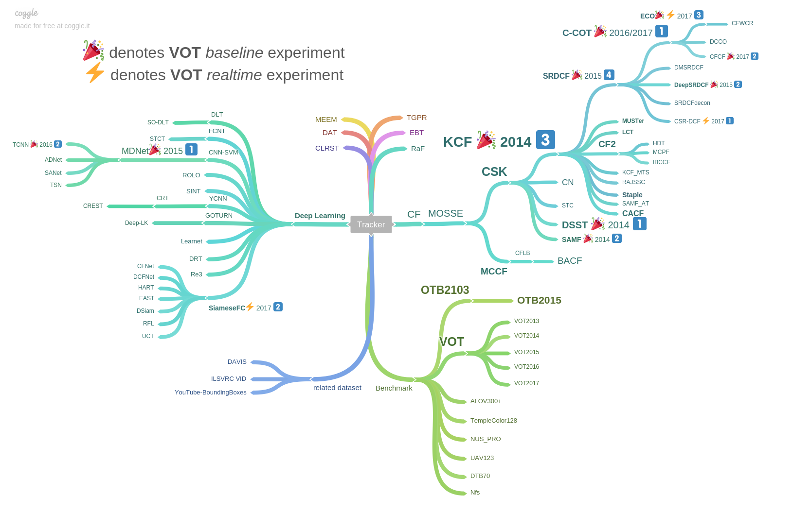

# Visual Tracking Paper List

## Papers

### :star2: Recommendations :star2:

- Goutam Bhat, Martin Danelljan, Luc Van Gool, Radu Timofte. 
  "Know Your Surroundings: Exploiting Scene Information for Object Tracking." Arxiv (2020).
  [[paper](https://arxiv.org/pdf/2003.11014v1.pdf)] 

### CVPR2020

* **MAML:** Guangting Wang, Chong Luo, Xiaoyan Sun, Zhiwei Xiong, Wenjun Zeng. 
  "Tracking by Instance Detection: A Meta-Learning Approach." CVPR (2020 **Oral**).
  [[paper](https://arxiv.org/pdf/2004.00830v1.pdf)]

* **Siam R-CNN:** Paul Voigtlaender, Jonathon Luiten, Philip H.S. Torr, Bastian Leibe. 
  "Siam R-CNN: Visual Tracking by Re-Detection." CVPR (2020).
  [[paper](https://arxiv.org/pdf/1911.12836.pdf)] 
  [[code](https://www.vision.rwth-aachen.de/page/siamrcnn)]

* **D3S:** Alan Lukežič, Jiří Matas, Matej Kristan. 
  "D3S – A Discriminative Single Shot Segmentation Tracker." CVPR (2020).
  [[paper](http://arxiv.org/pdf/1911.08862v2.pdf)]
  [[code](https://github.com/alanlukezic/d3s)]

* **PrDiMP:** Martin Danelljan, Luc Van Gool, Radu Timofte. 
  "Probabilistic Regression for Visual Tracking." CVPR (2020).
  [[paper](https://arxiv.org/pdf/2003.12565v1.pdf)]
  [[code](https://github.com/visionml/pytracking)]

* **ROAM:** Tianyu Yang, Pengfei Xu, Runbo Hu, Hua Chai, Antoni B. Chan. 
  "ROAM: Recurrently Optimizing Tracking Model." CVPR (2020).
  [[paper](https://arxiv.org/pdf/1907.12006v3.pdf)]

* **AutoTrack:** Yiming Li, Changhong Fu, Fangqiang Ding, Ziyuan Huang, Geng Lu. 
  "AutoTrack: Towards High-Performance Visual Tracking for UAV with Automatic Spatio-Temporal Regularization." CVPR (2020).
  [[paper](https://arxiv.org/pdf/2003.12949.pdf)]
  [[code](https://github.com/vision4robotics/AutoTrack)]

* **SiamBAN:** Zedu Chen, Bineng Zhong, Guorong Li, Shengping Zhang, Rongrong Ji. 
  "Siamese Box Adaptive Network for Visual Tracking." CVPR (2020).
  [[paper](http://arxiv.org/pdf/1911.08862v2.pdf)]
  [[code](https://github.com/hqucv/siamban)]

* **SiamAttn:** Yuechen Yu, Yilei Xiong, Weilin Huang, Matthew R. Scott.  
  "Deformable Siamese Attention Networks for Visual Object Tracking." CVPR (2020).
  [[paper](https://arxiv.org/pdf/2004.06711v1.pdf)]

* **CGACD:** Fei Du, Peng Liu, Wei Zhao, Xianglong Tang. 
  "Correlation-Guided Attention for Corner Detection Based Visual Tracking." CVPR (2020).

### AAAI 2020

- **SiamFC++:** Yinda Xu, Zeyu Wang, Zuoxin Li, Ye Yuan, Gang Yu.  
  "SiamFC++: Towards Robust and Accurate Visual Tracking with Target Estimation Guidelines." AAAI (2020).
  [[paper](https://arxiv.org/pdf/1911.06188v4.pdf)]
  [[code](https://github.com/MegviiDetection/video_analyst)]

### ICCV2019

* **DiMP:** Goutam Bhat, Martin Danelljan, Luc Van Gool, Radu Timofte. 
  "Learning Discriminative Model Prediction for Tracking." ICCV (2019 **oral**). 
  [[paper](http://openaccess.thecvf.com/content_ICCV_2019/papers/Bhat_Learning_Discriminative_Model_Prediction_for_Tracking_ICCV_2019_paper.pdf)]
  [[code](https://github.com/visionml/pytracking)]

* **GradNet:** Peixia Li, Boyu Chen, Wanli Ouyang, Dong Wang, Xiaoyun Yang, Huchuan Lu.  
  "GradNet: Gradient-Guided Network for Visual Object Tracking." ICCV (2019 **oral**).
  [[paper](http://openaccess.thecvf.com/content_ICCV_2019/papers/Li_GradNet_Gradient-Guided_Network_for_Visual_Object_Tracking_ICCV_2019_paper.pdf)]
  [[code](https://github.com/LPXTT/GradNet-Tensorflow)]

* **MLT:** Janghoon Choi, Junseok Kwon, Kyoung Mu Lee.  
  "Deep Meta Learning for Real-Time Target-Aware Visual Tracking." ICCV (2019).
  [[paper](http://openaccess.thecvf.com/content_ICCV_2019/papers/Choi_Deep_Meta_Learning_for_Real-Time_Target-Aware_Visual_Tracking_ICCV_2019_paper.pdf)]

* **SPLT:** Bin Yan, Haojie Zhao, Dong Wang, Huchuan Lu, Xiaoyun Yang  
  "'Skimming-Perusal' Tracking: A Framework for Real-Time and Robust Long-Term Tracking." ICCV (2019).
  [[paper](http://openaccess.thecvf.com/content_ICCV_2019/papers/Yan_Skimming-Perusal_Tracking_A_Framework_for_Real-Time_and_Robust_Long-Term_Tracking_ICCV_2019_paper.pdf)]
  [[code](https://github.com/iiau-tracker/SPLT)]

* **ARCF:** Ziyuan Huang, Changhong Fu, Yiming Li, Fuling Lin, Peng Lu.  
  "Learning Aberrance Repressed Correlation Filters for Real-Time UAV Tracking." ICCV (2019).
  [[paper](http://openaccess.thecvf.com/content_ICCV_2019/papers/Huang_Learning_Aberrance_Repressed_Correlation_Filters_for_Real-Time_UAV_Tracking_ICCV_2019_paper.pdf)]
  [[code](https://github.com/vision4robotics/ARCF-tracker)]

* Lianghua Huang, Xin Zhao, Kaiqi Huang.  
  "Bridging the Gap Between Detection and Tracking: A Unified Approach." ICCV (2019).
  [[paper](http://openaccess.thecvf.com/content_ICCV_2019/papers/Huang_Bridging_the_Gap_Between_Detection_and_Tracking_A_Unified_Approach_ICCV_2019_paper.pdf)]

* **UpdateNet:** Lichao Zhang, Abel Gonzalez-Garcia, Joost van de Weijer, Martin Danelljan, Fahad Shahbaz Khan.  
  "Learning the Model Update for Siamese Trackers." ICCV (2019).
  [[paper](http://openaccess.thecvf.com/content_ICCV_2019/papers/Zhang_Learning_the_Model_Update_for_Siamese_Trackers_ICCV_2019_paper.pdf)]
  [[code](https://github.com/zhanglichao/updatenet)]

* **PAT:** Rey Reza Wiyatno, Anqi Xu.  
  "Physical Adversarial Textures That Fool Visual Object Tracking." ICCV (2019).
  [[paper](http://openaccess.thecvf.com/content_ICCV_2019/papers/Wiyatno_Physical_Adversarial_Textures_That_Fool_Visual_Object_Tracking_ICCV_2019_paper.pdf)]

* **GFS-DCF:** Tianyang Xu, Zhen-Hua Feng, Xiao-Jun Wu, Josef Kittler.  
  "Joint Group Feature Selection and Discriminative Filter Learning for Robust Visual Object Tracking." ICCV (2019).
  [[paper](http://openaccess.thecvf.com/content_ICCV_2019/papers/Xu_Joint_Group_Feature_Selection_and_Discriminative_Filter_Learning_for_Robust_ICCV_2019_paper.pdf)]
  [[code](https://github.com/XU-TIANYANG/GFS-DCF)]

* **CDTB:** Alan Lukežič, Ugur Kart, Jani Käpylä, Ahmed Durmush, Joni-Kristian Kämäräinen, Jiří Matas, Matej Kristan.  

  "CDTB: A Color and Depth Visual Object Tracking Dataset and Benchmark." ICCV (2019).
  [[paper](http://openaccess.thecvf.com/content_ICCV_2019/papers/Lukezic_CDTB_A_Color_and_Depth_Visual_Object_Tracking_Dataset_and_ICCV_2019_paper.pdf)]

* **VOT2019:** Kristan, Matej, et al. 
  "The Seventh Visual Object Tracking VOT2019 Challenge Results." ICCV workshops (2019).
  [[paper](http://openaccess.thecvf.com/content_ICCVW_2019/papers/VOT/Kristan_The_Seventh_Visual_Object_Tracking_VOT2019_Challenge_Results_ICCVW_2019_paper.pdf)]

### CVPR2019

* **SiamMask:** Qiang Wang, Li Zhang, Luca Bertinetto, Weiming Hu, Philip H.S. Torr. 
  "Fast Online Object Tracking and Segmentation: A Unifying Approach." CVPR (2019). 
  [[paper](https://arxiv.org/pdf/1812.05050.pdf)]
  [[project](http://www.robots.ox.ac.uk/~qwang/SiamMask/)]
  [[code](https://github.com/foolwood/SiamMask)]

* **SiamRPN++:** Bo Li, Wei Wu, Qiang Wang, Fangyi Zhang, Junliang Xing, Junjie Yan. 
  "SiamRPN++: Evolution of Siamese Visual Tracking with Very Deep Networks." CVPR (2019 **oral**). 
  [[paper](http://openaccess.thecvf.com/content_CVPR_2019/papers/Li_SiamRPN_Evolution_of_Siamese_Visual_Tracking_With_Very_Deep_Networks_CVPR_2019_paper.pdf)]
  [[project](http://bo-li.info/SiamRPN++/)]

* **ATOM:** Martin Danelljan, Goutam Bhat, Fahad Shahbaz Khan, Michael Felsberg.  
  "ATOM: Accurate Tracking by Overlap Maximization." CVPR (2019 **oral**). 
  [[paper](http://openaccess.thecvf.com/content_CVPR_2019/papers/Danelljan_ATOM_Accurate_Tracking_by_Overlap_Maximization_CVPR_2019_paper.pdf)]
  [[code](https://github.com/visionml/pytracking)]

* **SiamDW:** Zhipeng Zhang, Houwen Peng. 
  "Deeper and Wider Siamese Networks for Real-Time Visual Tracking." CVPR (2019 **oral**). 
  [[paper](http://openaccess.thecvf.com/content_CVPR_2019/papers/Zhang_Deeper_and_Wider_Siamese_Networks_for_Real-Time_Visual_Tracking_CVPR_2019_paper.pdf)]
  [[code](https://github.com/researchmm/SiamDW)]

* **GCT:** Junyu Gao, Tianzhu Zhang, Changsheng Xu. 
  "Graph Convolutional Tracking." CVPR (2019 **oral**).
  [[paper](http://openaccess.thecvf.com/content_CVPR_2019/papers/Gao_Graph_Convolutional_Tracking_CVPR_2019_paper.pdf)]
  [[code](https://github.com/researchmm/SiamDW)]

* **ASRCF:** Kenan Dai, Dong Wang, Huchuan Lu, Chong Sun, Jianhua Li.  
  "Visual Tracking via Adaptive Spatially-Regularized Correlation Filters." CVPR (2019 **oral**).
  [[paper](http://openaccess.thecvf.com/content_CVPR_2019/papers/Dai_Visual_Tracking_via_Adaptive_Spatially-Regularized_Correlation_Filters_CVPR_2019_paper.pdf)]
  [[code](https://github.com/Daikenan/ASRCF)]

* **UDT:** Ning Wang, Yibing Song, Chao Ma, Wengang Zhou, Wei Liu, Houqiang Li. 
  "Unsupervised Deep Tracking." CVPR (2019). 
  [[paper](https://arxiv.org/pdf/1904.01828.pdf)]
  [[code](https://github.com/594422814/UDT)]

* **TADT:** Xin Li, Chao Ma, Baoyuan Wu, Zhenyu He, Ming-Hsuan Yang. 
  "Target-Aware Deep Tracking." CVPR (2019). 
  [[paper](https://arxiv.org/pdf/1904.01772.pdf)]
  [[project](https://xinli-zn.github.io/TADT-project-page/)]
  [[code](https://github.com/XinLi-zn/TADT)]

* **C-RPN:** Heng Fan, Haibin Ling. 
  "Siamese Cascaded Region Proposal Networks for Real-Time Visual Tracking." CVPR (2019). 
  [[paper](http://openaccess.thecvf.com/content_CVPR_2019/papers/Fan_Siamese_Cascaded_Region_Proposal_Networks_for_Real-Time_Visual_Tracking_CVPR_2019_paper.pdf)]

* **SPM:** Guangting Wang, Chong Luo, Zhiwei Xiong, Wenjun Zeng. 
  "SPM-Tracker: Series-Parallel Matching for Real-Time Visual Object Tracking." CVPR (2019). 
  [[paper](http://openaccess.thecvf.com/content_CVPR_2019/papers/Wang_SPM-Tracker_Series-Parallel_Matching_for_Real-Time_Visual_Object_Tracking_CVPR_2019_paper.pdf)]

* **OTR:** Ugur Kart, Alan Lukezic, Matej Kristan, Joni-Kristian Kamarainen, Jiri Matas.  
  "Object Tracking by Reconstruction with View-Specific Discriminative Correlation Filters." CVPR (2019). 
  [[paper](http://openaccess.thecvf.com/content_CVPR_2019/papers/Kart_Object_Tracking_by_Reconstruction_With_View-Specific_Discriminative_Correlation_Filters_CVPR_2019_paper.pdf)]
  [[code](https://github.com/ugurkart/OTR)]

* **RPCF:** Yuxuan Sun, Chong Sun, Dong Wang, Huchuan Lu, You He.  
  "ROI Pooled Correlation Filters for Visual Tracking." CVPR (2019).
  [[paper](http://openaccess.thecvf.com/content_CVPR_2019/papers/Sun_ROI_Pooled_Correlation_Filters_for_Visual_Tracking_CVPR_2019_paper.pdf)]

* **LaSOT:** Heng Fan, Liting Lin, Fan Yang, Peng Chu, Ge Deng, Sijia Yu, Hexin Bai, Yong Xu, Chunyuan Liao, Haibin Ling. 
  "LaSOT: A High-quality Benchmark for Large-scale Single Object Tracking." CVPR (2019). 
  [[paper](https://arxiv.org/pdf/1809.07845.pdf)]
  [[project](https://cis.temple.edu/lasot/)]

### AAAI2019

* **LDES:** Yang Li, Jianke Zhu, Steven C.H. Hoi, Wenjie Song, Zhefeng Wang, Hantang Liu. 
  "Robust Estimation of Similarity Transformation for Visual Object Tracking." AAAI (2019). 
  [[paper](https://arxiv.org/pdf/1712.05231.pdf)]
  [[code](https://github.com/ihpdep/LDES)] 

### NIPS2018

* **DAT:** Shi Pu, Yibing Song, Chao Ma, Honggang Zhang, Ming-Hsuan Yang. 
  "Deep Attentive Tracking via Reciprocative Learning." NIPS (2018). 
  [[paper](https://arxiv.org/pdf/1810.03851.pdf)] 
  [[project](https://ybsong00.github.io/nips18_tracking/index)] 
  [[code](https://github.com/shipubupt/NIPS2018)] 

### ECCV2018

* **UPDT:** Goutam Bhat, Joakim Johnander, Martin Danelljan, Fahad Shahbaz Khan, Michael Felsberg. 
  "Unveiling the Power of Deep Tracking." ECCV (2018). 
  [[paper](http://openaccess.thecvf.com/content_ECCV_2018/papers/Goutam_Bhat_Unveiling_the_Power_ECCV_2018_paper.pdf)]  

* **DaSiamRPN:** Zheng Zhu, Qiang Wang, Bo Li, Wu Wei, Junjie Yan, Weiming Hu. 
  "Distractor-aware Siamese Networks for Visual Object Tracking." ECCV (2018).
  [[paper](http://openaccess.thecvf.com/content_ECCV_2018/papers/Zheng_Zhu_Distractor-aware_Siamese_Networks_ECCV_2018_paper.pdf)]
  [[github](https://github.com/foolwood/DaSiamRPN)]

* **SACF:** Mengdan Zhang, Qiang Wang, Junliang Xing, Jin Gao, Peixi Peng, Weiming Hu, Steve Maybank. 
  "Visual Tracking via Spatially Aligned Correlation Filters Network." ECCV (2018).
  [[paper](http://openaccess.thecvf.com/content_ECCV_2018/papers/mengdan_zhang_Visual_Tracking_via_ECCV_2018_paper.pdf)]

* **RTINet:** Yingjie Yao, Xiaohe Wu, Lei Zhang, Shiguang Shan, Wangmeng Zuo. 
  "Joint Representation and Truncated Inference Learning for Correlation Filter based Tracking." ECCV (2018).
  [[paper](http://openaccess.thecvf.com/content_ECCV_2018/papers/Yingjie_Yao_Joint_Representation_and_ECCV_2018_paper.pdf)]

* **Meta-Tracker:** Eunbyung Park, Alexander C. Berg. 
  "Meta-Tracker: Fast and Robust Online Adaptation for Visual Object Trackers."
  [[paper](http://openaccess.thecvf.com/content_ECCV_2018/papers/Eunbyung_Park_Meta-Tracker_Fast_and_ECCV_2018_paper.pdf)]
  [[github](https://github.com/silverbottlep/meta_trackers)]

* **DSLT:** Xiankai Lu, Chao Ma*, Bingbing Ni, Xiaokang Yang, Ian Reid, Ming-Hsuan Yang. 
  "Deep Regression Tracking with Shrinkage Loss." ECCV (2018).
  [[paper](http://openaccess.thecvf.com/content_ECCV_2018/papers/Xiankai_Lu_Deep_Regression_Tracking_ECCV_2018_paper.pdf)]
  [[github](https://github.com/chaoma99/DSLT)]

* **DRL-IS:** Liangliang Ren, Xin Yuan, Jiwen Lu, Ming Yang, Jie Zhou. 
  "Deep Reinforcement Learning with Iterative Shift for Visual Tracking." ECCV (2018).
  [[paper](http://openaccess.thecvf.com/content_ECCV_2018/papers/Liangliang_Ren_Deep_Reinforcement_Learning_ECCV_2018_paper.pdf)]

* **RT-MDNet:** Ilchae Jung, Jeany Son, Mooyeol Baek, Bohyung Han. 
  "Real-Time MDNet." ECCV (2018).
  [[paper](http://openaccess.thecvf.com/content_ECCV_2018/papers/Ilchae_Jung_Real-Time_MDNet_ECCV_2018_paper.pdf)]

* **ACT:** Boyu Chen, Dong Wang, Peixia Li, Huchuan Lu. 
  "Real-time 'Actor-Critic' Tracking." ECCV (2018).
  [[paper](http://openaccess.thecvf.com/content_ECCV_2018/papers/Boyu_Chen_Real-time_Actor-Critic_Tracking_ECCV_2018_paper.pdf)]
  [[github](https://github.com/bychen515/ACT)]

* **StructSiam:** Yunhua Zhang, Lijun Wang, Dong Wang, Mengyang Feng, Huchuan Lu, Jinqing Qi. 
  "Structured Siamese Network for Real-Time Visual Tracking." ECCV (2018).
  [[paper](http://openaccess.thecvf.com/content_ECCV_2018/papers/Yunhua_Zhang_Structured_Siamese_Network_ECCV_2018_paper.pdf)]

* **MemTrack:** Tianyu Yang, Antoni B. Chan. 
  "Learning Dynamic Memory Networks for Object Tracking." ECCV (2018).
  [[paper](http://openaccess.thecvf.com/content_ECCV_2018/papers/Tianyu_Yang_Learning_Dynamic_Memory_ECCV_2018_paper.pdf)]

* **SiamFC-tri:** Xingping Dong, Jianbing Shen. 
  "Triplet Loss in Siamese Network for Object Tracking." ECCV (2018).
  [[paper](http://openaccess.thecvf.com/content_ECCV_2018/papers/Xingping_Dong_Triplet_Loss_with_ECCV_2018_paper.pdf)]
  [[github](https://github.com/shenjianbing/TripletTracking)]

* **OxUvA long-term dataset+benchmark:** Jack Valmadre, Luca Bertinetto, João F. Henriques, Ran Tao, Andrea Vedaldi, Arnold Smeulders, Philip Torr, Efstratios Gavves. 
  "Long-term Tracking in the Wild: a Benchmark." ECCV (2018).
  [[paper](http://openaccess.thecvf.com/content_ECCV_2018/papers/Efstratios_Gavves_Long-term_Tracking_in_ECCV_2018_paper.pdf)]
  [[project](https://oxuva.github.io/long-term-tracking-benchmark/)]

* **TrackingNet:** Matthias Müller, Adel Bibi, Silvio Giancola, Salman Al-Subaihi, Bernard Ghanem. 
  "TrackingNet: A Large-Scale Dataset and Benchmark for Object Tracking in the Wild." ECCV (2018).
  [[paper](http://openaccess.thecvf.com/content_ECCV_2018/papers/Matthias_Muller_TrackingNet_A_Large-Scale_ECCV_2018_paper.pdf)] 
  [[project](http://tracking-net.org/)]

### CVPR2018

* **VITAL:** Yibing Song, Chao Ma, Xiaohe Wu, Lijun Gong, Linchao Bao, Wangmeng Zuo, Chunhua Shen, Rynson Lau, and Ming-Hsuan Yang.
  "VITAL: VIsual Tracking via Adversarial Learning." CVPR (2018 **Spotlight**). 
  [[project](https://ybsong00.github.io/cvpr18_tracking/index)]
  [[paper](http://openaccess.thecvf.com/content_cvpr_2018/papers/Song_VITAL_VIsual_Tracking_CVPR_2018_paper.pdf)]
  [[github](https://github.com/ybsong00/Vital_release)]

* **LSART:** Chong Sun, Dong Wang, Huchuan Lu, Ming-Hsuan Yang.
  "Learning Spatial-Aware Regressions for Visual Tracking." CVPR (2018 **Spotlight**). 
  [[paper](http://openaccess.thecvf.com/content_cvpr_2018/papers/Sun_Learning_Spatial-Aware_Regressions_CVPR_2018_paper.pdf)]

* **SiamRPN:** Bo Li, Wei Wu, Zheng Zhu, Junjie Yan.
  "High Performance Visual Tracking with Siamese Region Proposal Network." CVPR (2018 **Spotlight**). 
  [[paper](http://openaccess.thecvf.com/content_cvpr_2018/papers/Li_High_Performance_Visual_CVPR_2018_paper.pdf)]

* **TRACA:** Jongwon Choi, Hyung Jin Chang, Tobias Fischer, Sangdoo Yun, Kyuewang Lee, Jiyeoup Jeong, Yiannis Demiris, Jin Young Choi.
  "Context-aware Deep Feature Compression for High-speed Visual Tracking." CVPR (2018). 
  [[project](https://sites.google.com/site/jwchoivision/)]
  [[paper](http://openaccess.thecvf.com/content_cvpr_2018/papers/Choi_Context-Aware_Deep_Feature_CVPR_2018_paper.pdf)]

* **RASNet:** Qiang Wang, Zhu Teng, Junliang Xing, Jin Gao, Weiming Hu, Stephen Maybank.
  "Learning Attentions: Residual Attentional Siamese Network for High Performance Online Visual Tracking." CVPR 2018. 
  [[paper](http://openaccess.thecvf.com/content_cvpr_2018/papers/Wang_Learning_Attentions_Residual_CVPR_2018_paper.pdf)]

* **SA-Siam:** Anfeng He, Chong Luo, Xinmei Tian, Wenjun Zeng.
  "A Twofold Siamese Network for Real-Time Object Tracking." CVPR (2018). 
  [[paper](http://openaccess.thecvf.com/content_cvpr_2018/papers/He_A_Twofold_Siamese_CVPR_2018_paper.pdf)]

* **STRCF:** Feng Li, Cheng Tian, Wangmeng Zuo, Lei Zhang, Ming-Hsuan Yang.
  "Learning Spatial-Temporal Regularized Correlation Filters for Visual Tracking." CVPR (2018). 
  [[paper](http://openaccess.thecvf.com/content_cvpr_2018/papers/Li_Learning_Spatial-Temporal_Regularized_CVPR_2018_paper.pdf)]
  [[github](https://github.com/lifeng9472/STRCF)]

* **FlowTrack:** Zheng Zhu, Wei Wu, Wei Zou, Junjie Yan.
  "End-to-end Flow Correlation Tracking with Spatial-temporal Attention." CVPR (2018). 
  [[paper](http://openaccess.thecvf.com/content_cvpr_2018/papers/Zhu_End-to-End_Flow_Correlation_CVPR_2018_paper.pdf)]

* **DEDT:** Kourosh Meshgi, Shigeyuki Oba, Shin Ishii.
  "Efficient Diverse Ensemble for Discriminative Co-Tracking." CVPR (2018). 
  [[paper](http://openaccess.thecvf.com/content_cvpr_2018/papers/Meshgi_Efficient_Diverse_Ensemble_CVPR_2018_paper.pdf)]

* **SINT++:** Xiao Wang, Chenglong Li, Bin Luo, Jin Tang.
  "SINT++: Robust Visual Tracking via Adversarial Positive Instance Generation." CVPR (2018).
  [[paper](http://openaccess.thecvf.com/content_cvpr_2018/papers/Wang_SINT_Robust_Visual_CVPR_2018_paper.pdf)]

* **DRT:** Chong Sun, Dong Wang, Huchuan Lu, Ming-Hsuan Yang.
  "Correlation Tracking via Joint Discrimination and Reliability Learning." CVPR (2018). 
  [[paper](http://openaccess.thecvf.com/content_cvpr_2018/papers/Sun_Correlation_Tracking_via_CVPR_2018_paper.pdf)]

* **MCCT:** Ning Wang, Wengang Zhou, Qi Tian, Richang Hong, Meng Wang, Houqiang Li.
  "Multi-Cue Correlation Filters for Robust Visual Tracking." CVPR (2018). 
  [[paper](http://openaccess.thecvf.com/content_cvpr_2018/papers/Wang_Multi-Cue_Correlation_Filters_CVPR_2018_paper.pdf)]
  [[github](https://github.com/594422814/MCCT)]

* **MKCF:** Ming Tang, Bin Yu, Fan Zhang, Jinqiao Wang.
  "High-speed Tracking with Multi-kernel Correlation Filters." CVPR (2018).
  [[paper](http://openaccess.thecvf.com/content_cvpr_2018/papers/Tang_High-Speed_Tracking_With_CVPR_2018_paper.pdf)]

* **HP:** Xingping Dong, Jianbing Shen, Wenguan Wang, Yu, Liu, Ling Shao, and Fatih Porikli.
  "Hyperparameter Optimization for Tracking with Continuous Deep Q-Learning." CVPR (2018).
  [[paper](http://openaccess.thecvf.com/content_cvpr_2018/papers/Dong_Hyperparameter_Optimization_for_CVPR_2018_paper.pdf)]

### NIPS2017

* **HART:** Adam R. Kosiorek, Alex Bewley, Ingmar Posner. 
  "Hierarchical Attentive Recurrent Tracking." NIPS (2017). 
  [[paper](https://papers.nips.cc/paper/6898-hierarchical-attentive-recurrent-tracking.pdf)]
  [[github](https://github.com/akosiorek/hart)]

### ICCV2017

* **CREST:** Yibing Song, Chao Ma, Lijun Gong, Jiawei Zhang, Rynson Lau, Ming-Hsuan Yang. 
  "CREST: Convolutional Residual Learning for Visual Tracking." ICCV (2017 **Spotlight**). 
  [[paper](http://openaccess.thecvf.com/content_ICCV_2017/papers/Song_CREST_Convolutional_Residual_ICCV_2017_paper.pdf)]
  [[project](http://www.cs.cityu.edu.hk/~yibisong/iccv17/index.html)]
  [[github](https://github.com/ybsong00/CREST-Release)]

* **EAST:** Chen Huang, Simon Lucey, Deva Ramanan.
  "Learning Policies for Adaptive Tracking with Deep Feature Cascades." ICCV (2017 **Spotlight**). 
  [[paper](http://openaccess.thecvf.com/content_ICCV_2017/papers/Huang_Learning_Policies_for_ICCV_2017_paper.pdf)]
  [[supp](http://openaccess.thecvf.com/content_ICCV_2017/supplemental/Huang_Learning_Policies_for_ICCV_2017_supplemental.zip)]

* **PTAV:** Heng Fan and Haibin Ling. 
  "Parallel Tracking and Verifying: A Framework for Real-Time and High Accuracy Visual Tracking." ICCV (2017). 
  [[paper](http://openaccess.thecvf.com/content_ICCV_2017/papers/Fan_Parallel_Tracking_and_ICCV_2017_paper.pdf)]
  [[supp](http://openaccess.thecvf.com/content_ICCV_2017/supplemental/Fan_Parallel_Tracking_and_ICCV_2017_supplemental.pdf)]
  [[project](http://www.dabi.temple.edu/~hbling/code/PTAV/ptav.htm)]
  [[code](http://www.dabi.temple.edu/~hbling/code/PTAV/serial_ptav_v1.zip)]

* **BACF:** Hamed Kiani Galoogahi, Ashton Fagg, Simon Lucey. 
  "Learning Background-Aware Correlation Filters for Visual Tracking." ICCV (2017). 
  [[paper](http://openaccess.thecvf.com/content_ICCV_2017/papers/Galoogahi_Learning_Background-Aware_Correlation_ICCV_2017_paper.pdf)]
  [[supp](http://openaccess.thecvf.com/content_ICCV_2017/supplemental/Galoogahi_Learning_Background-Aware_Correlation_ICCV_2017_supplemental.pdf)]
  [[code](http://www.hamedkiani.com/uploads/5/1/8/8/51882963/bacf_toupload.zip)]
  [[project](http://www.hamedkiani.com/bacf.html)]

* **TSN:** Zhu Teng, Junliang Xing, Qiang Wang, Congyan Lang, Songhe Feng and Yi Jin.
  "Robust Object Tracking based on Temporal and Spatial Deep Networks." ICCV (2017).
  [[paper](http://openaccess.thecvf.com/content_ICCV_2017/papers/Teng_Robust_Object_Tracking_ICCV_2017_paper.pdf)]

* **p-tracker:** James Supančič, III; Deva Ramanan.
  "Tracking as Online Decision-Making: Learning a Policy From Streaming Videos With Reinforcement Learning." ICCV (2017).
  [[paper](http://openaccess.thecvf.com/content_ICCV_2017/papers/Supancic_Tracking_as_Online_ICCV_2017_paper.pdf)]
  [[supp](http://openaccess.thecvf.com/content_ICCV_2017/supplemental/Supancic_Tracking_as_Online_ICCV_2017_supplemental.pdf)]

* **DSiam:** Qing Guo; Wei Feng; Ce Zhou; Rui Huang; Liang Wan; Song Wang.
  "Learning Dynamic Siamese Network for Visual Object Tracking." ICCV (2017).
  [[paper](http://openaccess.thecvf.com/content_ICCV_2017/papers/Guo_Learning_Dynamic_Siamese_ICCV_2017_paper.pdf)]
  [[github](https://github.com/tsingqguo/DSiam)]

* **SP-KCF:** Xin Sun; Ngai-Man Cheung; Hongxun Yao; Yiluan Guo.
  "Non-Rigid Object Tracking via Deformable Patches Using Shape-Preserved KCF and Level Sets." ICCV (2017).
  [[paper](http://openaccess.thecvf.com/content_ICCV_2017/papers/Sun_Non-Rigid_Object_Tracking_ICCV_2017_paper.pdf)]

* **UCT:** Zheng Zhu, Guan Huang, Wei Zou, Dalong Du, Chang Huang.
  "UCT: Learning Unified Convolutional Networks for Real-Time Visual Tracking." ICCV workshop (2017).
  [[paper](http://openaccess.thecvf.com/content_ICCV_2017_workshops/papers/w28/Zhu_UCT_Learning_Unified_ICCV_2017_paper.pdf)]

* Tobias Bottger, Patrick Follmann.
  "The Benefits of Evaluating Tracker Performance Using Pixel-Wise Segmentations." ICCV workshop (2017).
  [[paper](http://openaccess.thecvf.com/content_ICCV_2017_workshops/papers/w28/Bottger_The_Benefits_of_ICCV_2017_paper.pdf)]

* **CFWCR:** Zhiqun He, Yingruo Fan, Junfei Zhuang, Yuan Dong, HongLiang Bai.
  "Correlation Filters With Weighted Convolution Responses." ICCV workshop (2017).
  [[paper](http://openaccess.thecvf.com/content_ICCV_2017_workshops/papers/w28/He_Correlation_Filters_With_ICCV_2017_paper.pdf)]
  [[github](https://github.com/he010103/CFWCR)]

* **IBCCF:** Feng Li, Yingjie Yao, Peihua Li, David Zhang, Wangmeng Zuo, Ming-Hsuan Yang.
  "Integrating Boundary and Center Correlation Filters for Visual Tracking With Aspect Ratio Variation." ICCV workshop (2017).
  [[paper](http://openaccess.thecvf.com/content_ICCV_2017_workshops/papers/w28/Li_Integrating_Boundary_and_ICCV_2017_paper.pdf)]
  [[github](https://github.com/lifeng9472/IBCCF)]

* **RFL:** Tianyu Yang, Antoni B. Chan.
  "Recurrent Filter Learning for Visual Tracking." ICCV workshop (2017).
  [[paper](http://openaccess.thecvf.com/content_ICCV_2017_workshops/papers/w28/Yang_Recurrent_Filter_Learning_ICCV_2017_paper.pdf)]

### CVPR2017

* **ECO:** Martin Danelljan, Goutam Bhat, Fahad Shahbaz Khan, Michael Felsberg. 
  "ECO: Efficient Convolution Operators for Tracking." CVPR (2017). 
  [[paper](http://openaccess.thecvf.com/content_cvpr_2017/papers/Danelljan_ECO_Efficient_Convolution_CVPR_2017_paper.pdf)]
  [[supp](http://openaccess.thecvf.com/content_cvpr_2017/supplemental/Danelljan_ECO_Efficient_Convolution_2017_CVPR_supplemental.pdf)]
  [[project](http://www.cvl.isy.liu.se/research/objrec/visualtracking/ecotrack/index.html)]
  [[github](https://github.com/martin-danelljan/ECO)]

* **CFNet:** Jack Valmadre, Luca Bertinetto, João F. Henriques, Andrea Vedaldi, Philip H. S. Torr.
  "End-to-end representation learning for Correlation Filter based tracking." CVPR (2017). 
  [[paper](http://openaccess.thecvf.com/content_cvpr_2017/papers/Valmadre_End-To-End_Representation_Learning_CVPR_2017_paper.pdf)]
  [[supp](http://openaccess.thecvf.com/content_cvpr_2017/supplemental/Valmadre_End-To-End_Representation_Learning_2017_CVPR_supplemental.pdf)]
  [[project](http://www.robots.ox.ac.uk/~luca/cfnet.html)]
  [[github](https://github.com/bertinetto/cfnet)]

* **CACF:** Matthias Mueller, Neil Smith, Bernard Ghanem. 
  "Context-Aware Correlation Filter Tracking." CVPR (2017 **oral**). 
  [[paper](http://openaccess.thecvf.com/content_cvpr_2017/papers/Mueller_Context-Aware_Correlation_Filter_CVPR_2017_paper.pdf)]
  [[supp](http://openaccess.thecvf.com/content_cvpr_2017/supplemental/Mueller_Context-Aware_Correlation_Filter_2017_CVPR_supplemental.zip)]
  [[project](https://ivul.kaust.edu.sa/Pages/pub-ca-cf-tracking.aspx)]
  [[code](https://github.com/thias15/Context-Aware-CF-Tracking)]

* **RaF:** Le Zhang, Jagannadan Varadarajan, Ponnuthurai Nagaratnam Suganthan, Narendra Ahuja and Pierre Moulin
  "Robust Visual Tracking Using Oblique Random Forests." CVPR (2017). 
  [[paper](http://openaccess.thecvf.com/content_cvpr_2017/papers/Zhang_Robust_Visual_Tracking_CVPR_2017_paper.pdf)]
  [[supp](http://openaccess.thecvf.com/content_cvpr_2017/supplemental/Zhang_Robust_Visual_Tracking_2017_CVPR_supplemental.pdf)]
  [[project](https://sites.google.com/site/zhangleuestc/incremental-oblique-random-forest)]
  [[code](https://github.com/ZhangLeUestc/Incremental-Oblique-Random-Forest)]

* **MCPF:** Tianzhu Zhang, Changsheng Xu, Ming-Hsuan Yang. 
  "Multi-Task Correlation Particle Filter for Robust Object Tracking." CVPR (2017). 
  [[paper](http://openaccess.thecvf.com/content_cvpr_2017/papers/Zhang_Multi-Task_Correlation_Particle_CVPR_2017_paper.pdf)]
  [[project](http://nlpr-web.ia.ac.cn/mmc/homepage/tzzhang/mcpf.html)]
  [[code](http://nlpr-web.ia.ac.cn/mmc/homepage/tzzhang/mcpf.html)]

* **ACFN:** Jongwon Choi, Hyung Jin Chang, Sangdoo Yun, Tobias Fischer, Yiannis Demiris, and Jin Young Choi.
  "Attentional Correlation Filter Network for Adaptive Visual Tracking." CVPR (2017).
  [[paper](http://openaccess.thecvf.com/content_cvpr_2017/papers/Choi_Attentional_Correlation_Filter_CVPR_2017_paper.pdf)]
  [[supp](http://openaccess.thecvf.com/content_cvpr_2017/supplemental/Choi_Attentional_Correlation_Filter_2017_CVPR_supplemental.pdf)]
  [[project](https://sites.google.com/site/jwchoivision/home/acfn-1)]
  [[test code](https://drive.google.com/file/d/0B0ZkG8zaRQoLQUswbW9qSWFaU0U/view?usp=drive_web)]
  [[training code](https://drive.google.com/file/d/0B0ZkG8zaRQoLZVVranBnbHlydnM/view?usp=drive_web)]

* **LMCF:** Mengmeng Wang, Yong Liu, Zeyi Huang. 
  "Large Margin Object Tracking with Circulant Feature Maps." CVPR (2017). 
  [[paper](http://openaccess.thecvf.com/content_cvpr_2017/papers/Wang_Large_Margin_Object_CVPR_2017_paper.pdf)]
  [[zhihu](https://zhuanlan.zhihu.com/p/25761718)]

* **ADNet:** Sangdoo Yun, Jongwon Choi, Youngjoon Yoo, Kimin Yun, Jin Young Choi.
  "Action-Decision Networks for Visual Tracking with Deep Reinforcement Learning." CVPR (2017 **Spotlight**). 
  [[paper](http://openaccess.thecvf.com/content_cvpr_2017/papers/Yun_Action-Decision_Networks_for_CVPR_2017_paper.pdf)]
  [[supp](http://openaccess.thecvf.com/content_cvpr_2017/supplemental/Yun_Action-Decision_Networks_for_2017_CVPR_supplemental.pdf)]
  [[project](https://sites.google.com/view/cvpr2017-adnet)]

* **CSR-DCF:** Alan Lukežič, Tomáš Vojíř, Luka Čehovin, Jiří Matas, Matej Kristan. 
  "Discriminative Correlation Filter with Channel and Spatial Reliability." CVPR (2017). 
  [[paper](http://openaccess.thecvf.com/content_cvpr_2017/papers/Lukezic_Discriminative_Correlation_Filter_CVPR_2017_paper.pdf)]
  [[supp](http://openaccess.thecvf.com/content_cvpr_2017/supplemental/Lukezic_Discriminative_Correlation_Filter_2017_CVPR_supplemental.pdf)]
  [[code](https://github.com/alanlukezic/csr-dcf)]

* **BranchOut:** Bohyung Han, Jack Sim, Hartwig Adam.
  "BranchOut: Regularization for Online Ensemble Tracking with Convolutional Neural Networks." CVPR (2017). 
  [[paper](http://openaccess.thecvf.com/content_cvpr_2017/papers/Han_BranchOut_Regularization_for_CVPR_2017_paper.pdf)]

* **AMCT:** Donghun Yeo, Jeany Son, Bohyung Han, Joonhee Han.
  "Superpixel-based Tracking-by-Segmentation using Markov Chains." CVPR (2017).
  [[paper](http://openaccess.thecvf.com/content_cvpr_2017/papers/Yeo_Superpixel-Based_Tracking-By-Segmentation_Using_CVPR_2017_paper.pdf)]

* **SANet:** Heng Fan, Haibin Ling. 
  "SANet: Structure-Aware Network for Visual Tracking." CVPRW (2017). 
  [[paper](https://arxiv.org/pdf/1611.06878.pdf)]
  [[project](http://www.dabi.temple.edu/~hbling/code/SANet/SANet.html)]
  [[code](http://www.dabi.temple.edu/~hbling/code/SANet/sanet_code.zip)]

### ECCV2016

* **SiameseFC:** Luca Bertinetto, Jack Valmadre, João F. Henriques, Andrea Vedaldi, Philip H.S. Torr. 
  "Fully-Convolutional Siamese Networks for Object Tracking." ECCV workshop (2016). 
  [[paper](http://120.52.73.78/arxiv.org/pdf/1606.09549v2.pdf)]
  [[project](http://www.robots.ox.ac.uk/~luca/siamese-fc.html)]
  [[github](https://github.com/bertinetto/siamese-fc)]

* **GOTURN:** David Held, Sebastian Thrun, Silvio Savarese. 
  "Learning to Track at 100 FPS with Deep Regression Networks." ECCV (2016). 
  [[paper](http://davheld.github.io/GOTURN/GOTURN.pdf)]
  [[project](http://davheld.github.io/GOTURN/GOTURN.html)]
  [[github](https://github.com/davheld/GOTURN)]

* **C-COT:** Martin Danelljan, Andreas Robinson, Fahad Khan, Michael Felsberg. 
  "Beyond Correlation Filters: Learning Continuous Convolution Operators for Visual Tracking." ECCV (2016). 
  [[paper](http://www.cvl.isy.liu.se/research/objrec/visualtracking/conttrack/C-COT_ECCV16.pdf)]
  [[project](http://www.cvl.isy.liu.se/research/objrec/visualtracking/conttrack/index.html)]
  [[github](https://github.com/martin-danelljan/Continuous-ConvOp)]

* **CF+AT:** Adel Bibi, Matthias Mueller, and Bernard Ghanem. 
  "Target Response Adaptation for Correlation Filter Tracking." ECCV (2016). 
  [[paper](http://www.adelbibi.com/papers/ECCV2016/Target_Adap.pdf)]
  [[project](https://ivul.kaust.edu.sa/Pages/pub-target-response-adaptation.aspx)]
  [[github](https://github.com/adelbibi/Target-Response-Adaptation-for-Correlation-Filter-Tracking)]

* Yao Sui, Ziming Zhang,  Guanghui Wang, Yafei Tang, Li Zhang. 
  "Real-Time Visual Tracking: Promoting the Robustness of Correlation Filter Learning." ECCV (2016). 
  [[paper](http://120.52.73.78/arxiv.org/pdf/1608.08173.pdf)]

* Yao Sui, Guanghui Wang, Yafei Tang, Li Zhang. 
  "Tracking Completion." ECCV (2016). 
  [[paper](http://120.52.73.78/arxiv.org/pdf/1608.08171v1.pdf)]

### CVPR2016

* **MDNet:** Nam, Hyeonseob, and Bohyung Han. 
  "Learning Multi-Domain Convolutional Neural Networks for Visual Tracking." CVPR (2016).
  [[paper](http://arxiv.org/pdf/1510.07945v2.pdf)]
  [[VOT_presentation](http://votchallenge.net/vot2015/download/presentation_Hyeonseob.pdf)]
  [[project](http://cvlab.postech.ac.kr/research/mdnet/)]
  [[github](https://github.com/HyeonseobNam/MDNet)]

* **SINT:** Ran Tao, Efstratios Gavves, Arnold W.M. Smeulders. 
  "Siamese Instance Search for Tracking." CVPR (2016).
  [[paper](https://staff.science.uva.nl/r.tao/pub/TaoCVPR2016.pdf)]
  [[project](https://staff.fnwi.uva.nl/r.tao/projects/SINT/SINT_proj.html)]

* **SCT:** Jongwon Choi, Hyung Jin Chang, Jiyeoup Jeong, Yiannis Demiris, and Jin Young Choi.
  "Visual Tracking Using Attention-Modulated Disintegration and Integration." CVPR (2016).
  [[paper](http://www.cv-foundation.org/openaccess/content_cvpr_2016/papers/Choi_Visual_Tracking_Using_CVPR_2016_paper.pdf)]
  [[project](https://sites.google.com/site/jwchoivision/home/sct)]

* **STCT:** Lijun Wang, Wanli Ouyang, Xiaogang Wang, and Huchuan Lu.
  "STCT: Sequentially Training Convolutional Networks for Visual Tracking." CVPR (2016).
  [[paper](http://www.ee.cuhk.edu.hk/~wlouyang/Papers/WangLJ_CVPR16.pdf)]
  [[github](https://github.com/scott89/STCT)]

* **SRDCFdecon:** Martin Danelljan, Gustav Häger, Fahad Khan, Michael Felsberg. 
  "Adaptive Decontamination of the Training Set: A Unified Formulation for Discriminative Visual Tracking." CVPR (2016).
  [[paper](https://www.cvl.isy.liu.se/research/objrec/visualtracking/decontrack/AdaptiveDecon_CVPR16.pdf)]
  [[project](https://www.cvl.isy.liu.se/research/objrec/visualtracking/decontrack/index.html)]

* **HDT:** Yuankai Qi, Shengping Zhang, Lei Qin, Hongxun Yao, Qingming Huang, Jongwoo Lim, Ming-Hsuan Yang. 
  "Hedged Deep Tracking." CVPR (2016). 
  [[paper](http://faculty.ucmerced.edu/mhyang/papers/cvpr16_hedge_tracking.pdf)]
  [[project](https://sites.google.com/site/yuankiqi/hdt/)]

* **Staple:** Luca Bertinetto, Jack Valmadre, Stuart Golodetz, Ondrej Miksik, Philip H.S. Torr. 
  "Staple: Complementary Learners for Real-Time Tracking." CVPR (2016). 
  [[paper](http://120.52.73.75/arxiv.org/pdf/1512.01355v2.pdf)]
  [[project](http://www.robots.ox.ac.uk/~luca/staple.html)]
  [[github](https://github.com/bertinetto/staple)]

* **EBT:** Gao Zhu, Fatih Porikli, and Hongdong Li.
  "Beyond Local Search: Tracking Objects Everywhere with Instance-Specific Proposals." CVPR (2016). 
  [[paper](http://www.cv-foundation.org/openaccess/content_cvpr_2016/papers/Zhu_Beyond_Local_Search_CVPR_2016_paper.pdf)]
  [[exe](http://www.votchallenge.net/vot2016/download/02_EBT.zip)]

* **DLSSVM:** Jifeng Ning, Jimei Yang, Shaojie Jiang, Lei Zhang and Ming-Hsuan Yang. 
  "Object Tracking via Dual Linear Structured SVM and Explicit Feature Map." CVPR (2016). 
  [[paper](http://www4.comp.polyu.edu.hk/~cslzhang/paper/cvpr16/DLSSVM.pdf)]
  [[code](http://www4.comp.polyu.edu.hk/~cslzhang/code/DLSSVM_CVPR.zip)]
  [[project](http://www4.comp.polyu.edu.hk/~cslzhang/DLSSVM/DLSSVM.htm)]

### NIPS2016
* **Learnet:** Luca Bertinetto, João F. Henriques, Jack Valmadre, Philip H. S. Torr, Andrea Vedaldi. 
  "Learning feed-forward one-shot learners." NIPS (2016). 
  [[paper](https://arxiv.org/pdf/1606.05233v1.pdf)]

### ICCV2015

* **FCNT:** Lijun Wang, Wanli Ouyang, Xiaogang Wang, and Huchuan Lu. 
  "Visual Tracking with Fully Convolutional Networks." ICCV (2015). 
  [[paper](http://202.118.75.4/lu/Paper/ICCV2015/iccv15_lijun.pdf)]
  [[project](http://scott89.github.io/FCNT/)]
  [[github](https://github.com/scott89/FCNT)]

* **SRDCF:** Martin Danelljan, Gustav Häger, Fahad Khan, Michael Felsberg. 
  "Learning Spatially Regularized Correlation Filters for Visual Tracking." ICCV (2015). 
  [[paper](https://www.cvl.isy.liu.se/research/objrec/visualtracking/regvistrack/SRDCF_ICCV15.pdf)]
  [[project](https://www.cvl.isy.liu.se/research/objrec/visualtracking/regvistrack/)]

* **CF2:** Chao Ma, Jia-Bin Huang, Xiaokang Yang and Ming-Hsuan Yang.
  "Hierarchical Convolutional Features for Visual Tracking." ICCV (2015)
  [[paper](http://faculty.ucmerced.edu/mhyang/papers/iccv15_tracking.pdf)]
  [[project](https://sites.google.com/site/jbhuang0604/publications/cf2)]
  [[github](https://github.com/jbhuang0604/CF2)]

* Naiyan Wang, Jianping Shi, Dit-Yan Yeung and Jiaya Jia.
  "Understanding and Diagnosing Visual Tracking Systems." ICCV (2015). 
  [[paper](http://winsty.net/papers/diagnose.pdf)]
  [[project](http://winsty.net/tracker_diagnose.html)]
  [[code](http://winsty.net/diagnose/diagnose_code.zip)]\

* **DeepSRDCF:** Martin Danelljan, Gustav Häger, Fahad Khan, Michael Felsberg. 
  "Convolutional Features for Correlation Filter Based Visual Tracking." ICCV workshop (2015). 
  [[paper](https://www.cvl.isy.liu.se/research/objrec/visualtracking/regvistrack/ConvDCF_ICCV15_VOTworkshop.pdf)]
  [[project](https://www.cvl.isy.liu.se/research/objrec/visualtracking/regvistrack/)]

* **RAJSSC:** Mengdan Zhang, Junliang Xing, Jin Gao, Xinchu Shi, Qiang Wang, Weiming Hu. 
  "Joint Scale-Spatial Correlation Tracking with Adaptive Rotation Estimation." ICCV workshop (2015). 
  [[paper](http://www.cv-foundation.org//openaccess/content_iccv_2015_workshops/w14/papers/Zhang_Joint_Scale-Spatial_Correlation_ICCV_2015_paper.pdf)]
  [[poster](http://www.votchallenge.net/vot2015/download/poster_Mengdan_Zhang.pdf)]

### CVPR2015

* **MUSTer:** Zhibin Hong, Zhe Chen, Chaohui Wang, Xue Mei, Danil Prokhorov, Dacheng Tao. 
  "MUlti-Store Tracker (MUSTer): A Cognitive Psychology Inspired Approach to Object Tracking." CVPR (2015). 
  [[paper](http://openaccess.thecvf.com/content_cvpr_2015/papers/Hong_MUlti-Store_Tracker_MUSTer_2015_CVPR_paper.pdf)]
  [[project](https://sites.google.com/site/multistoretrackermuster/)]

* **LCT:** Chao Ma, Xiaokang Yang, Chongyang Zhang, Ming-Hsuan Yang.
  "Long-term Correlation Tracking." CVPR (2015).
  [[paper](http://openaccess.thecvf.com/content_cvpr_2015/papers/Ma_Long-Term_Correlation_Tracking_2015_CVPR_paper.pdf)]
  [[project](https://sites.google.com/site/chaoma99/cvpr15_tracking)]
  [[github](https://github.com/chaoma99/lct-tracker)]

* **DAT:** Horst Possegger, Thomas Mauthner, and Horst Bischof. 
  "In Defense of Color-based Model-free Tracking." CVPR (2015). 
  [[paper](https://lrs.icg.tugraz.at/pubs/possegger_cvpr15.pdf)]
  [[project](https://www.tugraz.at/institute/icg/research/team-bischof/lrs/downloads/dat)]
  [[code](https://lrs.icg.tugraz.at/downloads/dat-v1.0.zip)]

* **RPT:** Yang Li, Jianke Zhu and Steven C.H. Hoi. 
  "Reliable Patch Trackers: Robust Visual Tracking by Exploiting Reliable Patches." CVPR (2015). 
  [[paper](https://github.com/ihpdep/ihpdep.github.io/raw/master/papers/cvpr15_rpt.pdf)]
  [[github](https://github.com/ihpdep/rpt)]

### ICML2015

* **CNN-SVM:** Seunghoon Hong, Tackgeun You, Suha Kwak and Bohyung Han.
  "Online Tracking by Learning Discriminative Saliency Map with Convolutional Neural Network ." ICML (2015)
  [[paper](http://120.52.73.80/arxiv.org/pdf/1502.06796.pdf)]
  [[project](http://cvlab.postech.ac.kr/research/CNN_SVM/)]

### BMVC2014

* **DSST:** Martin Danelljan, Gustav Häger, Fahad Shahbaz Khan and Michael Felsberg. 
  "Accurate Scale Estimation for Robust Visual Tracking." BMVC (2014).
  [[paper](http://www.cvl.isy.liu.se/research/objrec/visualtracking/scalvistrack/ScaleTracking_BMVC14.pdf)]
  [[PAMI](http://www.cvl.isy.liu.se/en/research/objrec/visualtracking/scalvistrack/DSST_TPAMI.pdf)]
  [[project](http://www.cvl.isy.liu.se/en/research/objrec/visualtracking/scalvistrack/index.html)]

### ECCV2014

* **MEEM:** Jianming Zhang, Shugao Ma, and Stan Sclaroff.
  "MEEM: Robust Tracking via Multiple Experts using Entropy Minimization." ECCV (2014).
  [[paper](http://cs-people.bu.edu/jmzhang/MEEM/MEEM-eccv-preprint.pdf)]
  [[project](http://cs-people.bu.edu/jmzhang/MEEM/MEEM.html)]

* **TGPR:** Jin Gao, Haibin Ling, Weiming Hu, Junliang Xing.
  "Transfer Learning Based Visual Tracking with Gaussian Process Regression." ECCV (2014).
  [[paper](http://www.dabi.temple.edu/~hbling/publication/tgpr-eccv14.pdf)]
  [[project](http://www.dabi.temple.edu/~hbling/code/TGPR.htm)]

* **STC:** Kaihua Zhang, Lei Zhang, Ming-Hsuan Yang, David Zhang.
  "Fast Tracking via Spatio-Temporal Context Learning." ECCV (2014).
  [[paper](http://arxiv.org/pdf/1311.1939v1.pdf)]
  [[project](http://www4.comp.polyu.edu.hk/~cslzhang/STC/STC.htm)]

* **SAMF:** Yang Li, Jianke Zhu.
  "A Scale Adaptive Kernel Correlation Filter Tracker with Feature Integration." ECCV workshop (2014).
  [[paper](http://link.springer.com/content/pdf/10.1007%2F978-3-319-16181-5_18.pdf)]
  [[github](https://github.com/ihpdep/samf)]

### NIPS2013

* **DLT:** Naiyan Wang and Dit-Yan Yeung. 
  "Learning A Deep Compact Image Representation for Visual Tracking." NIPS (2013). 
  [[paper](http://winsty.net/papers/dlt.pdf)]
  [[project](http://winsty.net/dlt.html)]
  [[code](http://winsty.net/dlt/DLTcode.zip)]

### PAMI & IJCV & TIP

* **AOGTracker:** Tianfu Wu , Yang Lu and Song-Chun Zhu. 
  "Online Object Tracking, Learning and Parsing with And-Or Graphs." TPAMI (2017).
  [[paper](http://www4.ncsu.edu/~twu19/papers/AOGTracker_PAMI.pdf)]
  [[project](http://www4.ncsu.edu/~twu19/project_posts/AOGTracker/)]
  [[github](https://github.com/tfwu/RGM-AOGTracker)] 

* **MCPF:** Tianzhu Zhang, Changsheng Xu, Ming-Hsuan Yang.
    " Learning Multi-task Correlation Particle Filters for Visual Tracking." TPAMI (2017).
      [[paper]]
      [[project](http://nlpr-web.ia.ac.cn/mmc/homepage/tzzhang/lmcpf.html)]
      [[code](http://nlpr-web.ia.ac.cn/mmc/homepage/tzzhang/Project_Tianzhu/zhang_mcpf/Source_Code/Source_Code.zip)] 

* **RSST:** Tianzhu Zhang, Changsheng Xu, Ming-Hsuan Yang.
  " Robust Structural Sparse Tracking." TPAMI (2017).
  [[paper]]
  [[project](http://nlpr-web.ia.ac.cn/mmc/homepage/tzzhang/rsst.html)]
  [[code](http://nlpr-web.ia.ac.cn/mmc/homepage/tzzhang/Project_Tianzhu/zhang_RSST/RSSTDeep/RSSTDeep_Code.zip)] 

* **fDSST:** Martin Danelljan, Gustav Häger, Fahad Khan, Michael Felsberg.
  "Discriminative Scale Space Tracking." TPAMI (2017).
  [[paper](http://www.cvl.isy.liu.se/research/objrec/visualtracking/scalvistrack/DSST_TPAMI.pdf)]
  [[project](http://www.cvl.isy.liu.se/research/objrec/visualtracking/scalvistrack/index.html)]
  [[code](http://www.cvl.isy.liu.se/research/objrec/visualtracking/scalvistrack/fDSST_code.zip)] 

* **KCF:** João F. Henriques, Rui Caseiro, Pedro Martins, Jorge Batista. 
  "High-Speed Tracking with Kernelized Correlation Filters." TPAMI (2015).
  [[paper](http://www.robots.ox.ac.uk/~joao/publications/henriques_tpami2015.pdf)]
  [[project](http://www.robots.ox.ac.uk/~joao/circulant/)]

* **CLRST:** Tianzhu Zhang, Si Liu, Narendra Ahuja, Ming-Hsuan Yang, Bernard Ghanem.  
  "Robust Visual Tracking Via Consistent Low-Rank Sparse Learning." IJCV (2015). 
  [[paper](http://nlpr-web.ia.ac.cn/mmc/homepage/tzzhang/tianzhu%20zhang_files/Journal%20Articles/IJCV15_zhang_Low-Rank%20Sparse%20Learning.pdf)]
  [[project](http://nlpr-web.ia.ac.cn/mmc/homepage/tzzhang/Project_Tianzhu/zhang_IJCV14/Robust%20Visual%20Tracking%20Via%20Consistent%20Low-Rank%20Sparse.html)]
  [[code](http://nlpr-web.ia.ac.cn/mmc/homepage/tzzhang/Project_Tianzhu/zhang_IJCV14/material/LRT_Code.zip)]

* **DNT:** Zhizhen Chi, Hongyang Li, Huchuan Lu, Ming-Hsuan Yang. 
  "Dual Deep Network for Visual Tracking." TIP (2017). 
  [[paper](https://arxiv.org/pdf/1612.06053v1.pdf)]

* **DRT:** Junyu Gao, Tianzhu Zhang, Xiaoshan Yang, Changsheng Xu. 
  "Deep Relative Tracking." TIP (2017). 
  [[paper](http://ieeexplore.ieee.org/abstract/document/7828108/)]

* **BIT:** Bolun Cai, Xiangmin Xu, Xiaofen Xing, Kui Jia, Jie Miao, Dacheng Tao.
  "BIT: Biologically Inspired Tracker." TIP (2016). 
  [[paper](http://caibolun.github.io/papers/BIT_TIP.pdf)]
  [[project](http://caibolun.github.io/BIT/index.html)]
  [[github](https://github.com/caibolun/BIT)]

* **CNT:** Kaihua Zhang, Qingshan Liu, Yi Wu, Minghsuan Yang. 
  "Robust Visual Tracking via Convolutional Networks Without Training." TIP (2016). 
  [[paper](http://kaihuazhang.net/CNT.pdf)]
  [[code](http://kaihuazhang.net/CNT_matlab.rar)]

## ArXiv

* **MLT:** Janghoon Choi, Junseok Kwon, Kyoung Mu Lee.
  "Deep Meta Learning for Real-Time Visual Tracking based on Target-Specific Feature Space." arXiv (2017). 
  [[paper](https://arxiv.org/pdf/1712.09153v1.pdf)]

* **STECF:** Yang Li, Jianke Zhu, Wenjie Song, Zhefeng Wang, Hantang Liu, Steven C. H. Hoi.
  "Robust Estimation of Similarity Transformation for Visual Object Tracking with Correlation Filters." arXiv (2017). 
  [[paper](https://arxiv.org/pdf/1712.05231v1.pdf)]

* **PAWSS:** Xiaofei Du, Alessio Dore, Danail Stoyanov. 
  "Patch-based adaptive weighting with segmentation and scale (PAWSS) for visual tracking." arXiv (2017). 
  [[paper](https://arxiv.org/pdf/1708.01179v1.pdf)]

* **SFT:** Zhen Cui, You yi Cai, Wen ming Zheng, Jian Yang. 
  "Spectral Filter Tracking." arXiv (2017). 
  [[paper](https://arxiv.org/pdf/1707.05553v1.pdf)]

* **Re3:** Daniel Gordon, Ali Farhadi, Dieter Fox. 
  "Re3 : Real-Time Recurrent Regression Networks for Object Tracking." arXiv (2017). 
  [[paper](https://arxiv.org/pdf/1705.06368.pdf)]

* **DCFNet:** Qiang Wang, Jin Gao, Junliang Xing, Mengdan Zhang, Weiming Hu. 
  "DCFNet: Discriminant Correlation Filters Network for Visual Tracking." arXiv (2017). 
  [[paper](https://arxiv.org/pdf/1704.04057.pdf)]
  [[code](https://github.com/foolwood/DCFNet#dcfnet-discriminant-correlation-filters-network-for-visual-tracking)]

* **TCNN:** Hyeonseob Nam, Mooyeol Baek, Bohyung Han. 
  "Modeling and Propagating CNNs in a Tree Structure for Visual Tracking." arXiv (2016). 
  [[paper](http://arxiv.org/pdf/1608.07242v1.pdf)]
  [[code](http://www.votchallenge.net/vot2016/download/44_TCNN.zip)]

* **RDT:** Janghoon Choi, Junseok Kwon, Kyoung Mu Lee. 
  "Visual Tracking by Reinforced Decision Making." arXiv (2017). 
  [[paper](https://arxiv.org/pdf/1702.06291.pdf)]

* **MSDAT:** Xinyu Wang, Hanxi Li, Yi Li, Fumin Shen, Fatih Porikli .
  "Robust and Real-time Deep Tracking Via Multi-Scale Domain Adaptation." arXiv (2017). 
  [[paper](https://arxiv.org/pdf/1701.00561.pdf)]

* **RLT:** Da Zhang, Hamid Maei, Xin Wang, Yuan-Fang Wang.
  "Deep Reinforcement Learning for Visual Object Tracking in Videos." arXiv (2017). 
  [[paper](https://arxiv.org/pdf/1701.08936v1.pdf)]

* **SCF:** Wangmeng Zuo, Xiaohe Wu, Liang Lin, Lei Zhang, Ming-Hsuan Yang. 
  "Learning Support Correlation Filters for Visual Tracking." arXiv (2016).
  [[paper](https://arxiv.org/pdf/1601.06032.pdf)]
  [[project](http://faculty.ucmerced.edu/mhyang/project/scf/)]

* **CRT:** Kai Chen, Wenbing Tao. 
  "Convolutional Regression for Visual Tracking." arXiv (2016). 
  [[paper](https://arxiv.org/pdf/1611.04215.pdf)]

* **BMR:** Kaihua Zhang, Qingshan Liu, and Ming-Hsuan Yang. 
  "Visual Tracking via Boolean Map Representations." arXiv (2016). 
  [[paper](https://arxiv.org/pdf/1610.09652v1.pdf)]

* **YCNN:** Kai Chen, Wenbing Tao. 
  "Once for All: a Two-flow Convolutional Neural Network for Visual Tracking." arXiv (2016). 
  [[paper](https://arxiv.org/pdf/1604.07507v1.pdf)]

* **ROLO:** Guanghan Ning, Zhi Zhang, Chen Huang, Zhihai He, Xiaobo Ren, Haohong Wang. 
  "Spatially Supervised Recurrent Convolutional Neural Networks for Visual Object Tracking." arXiv (2016). 
  [[paper](http://arxiv.org/pdf/1607.05781v1.pdf)]
  [[project](http://guanghan.info/projects/ROLO/)]
  [[github](https://github.com/Guanghan/ROLO/)]

* **RATM:** Samira Ebrahimi Kahou, Vincent Michalski, Roland Memisevic. 
  "RATM: Recurrent Attentive Tracking Model." arXiv (2015). 
  [[paper](https://arxiv.org/pdf/1510.08660v4.pdf)]
  [[github](https://github.com/saebrahimi/RATM)]

* **SO-DLT:** Naiyan Wang, Siyi Li, Abhinav Gupta, Dit-Yan Yeung. 
  "Transferring Rich Feature Hierarchies for Robust Visual Tracking." arXiv (2015). 
  [[paper](https://arxiv.org/pdf/1501.04587v2.pdf)]
  [[code](http://www.votchallenge.net/vot2016/download/08_SO-DLT.zip)]

* **DMSRDCF:** Susanna Gladh, Martin Danelljan, Fahad Shahbaz Khan, Michael Felsberg. 
  "Deep Motion Features for Visual Tracking." ICPR **Best Paper** (2016). 
  [[paper](https://arxiv.org/pdf/1612.06615v1.pdf)]

## Benchmark

* **LaSOT:** Heng Fan, Liting Lin, Fan Yang, Peng Chu, Ge Deng, Sijia Yu, Hexin Bai, Yong Xu, Chunyuan Liao, Haibin Ling.
  "Deep Meta Learning for Real-Time Visual Tracking based on Target-Specific Feature Space." arXiv (2018). 
  [[paper](https://arxiv.org/pdf/1809.07845.pdf)]
  [[project](https://cis.temple.edu/lasot/)]

* **OxUvA long-term dataset+benchmark:** Jack Valmadre, Luca Bertinetto, João F. Henriques, Ran Tao, Andrea Vedaldi, Arnold Smeulders, Philip Torr, Efstratios Gavves. 
  "Long-term Tracking in the Wild: a Benchmark." ECCV (2018).
  [[paper](https://arxiv.org/pdf/1803.09502.pdf)]
  [[project](https://oxuva.github.io/long-term-tracking-benchmark/)]

* **TrackingNet:** Matthias Müller, Adel Bibi, Silvio Giancola, Salman Al-Subaihi, Bernard Ghanem. 
  "TrackingNet: A Large-Scale Dataset and Benchmark for Object Tracking in the Wild." ECCV (2018).
  [[project](https://silviogiancola.github.io/publication/2018-03-trackingnet/details/)]
  [[paper](https://arxiv.org/pdf/1803.10794.pdf)] 

* **UAVDT:** Dawei Du, Yuankai Qi, Hongyang Yu, Yifang Yang, Kaiwen Duan, GuoRong Li, Weigang Zhang,  Weihai; Qingming Huang, Qi Tian. 
  "The Unmanned Aerial Vehicle Benchmark: Object Detection and Tracking." ECCV (2018).
  [[paper](https://arxiv.org/pdf/1804.00518.pdf)]

* **Dataset-AMP:** Luka Čehovin Zajc; Alan Lukežič; Aleš Leonardis; Matej Kristan.
  "Beyond Standard Benchmarks: Parameterizing Performance Evaluation in Visual Object Tracking." ICCV (2017).
  [[paper](http://openaccess.thecvf.com/content_ICCV_2017/papers/Zajc_Beyond_Standard_Benchmarks_ICCV_2017_paper.pdf)]

* **Dataset-Nfs:** Hamed Kiani Galoogahi, Ashton Fagg, Chen Huang, Deva Ramanan and Simon Lucey.
  "Need for Speed: A Benchmark for Higher Frame Rate Object Tracking." ICCV (2017)
  [[paper](http://openaccess.thecvf.com/content_ICCV_2017/papers/Galoogahi_Need_for_Speed_ICCV_2017_paper.pdf)]
  [[supp](http://openaccess.thecvf.com/content_ICCV_2017/supplemental/Galoogahi_Need_for_Speed_ICCV_2017_supplemental.pdf)]
  [[project](http://ci2cv.net/nfs/index.html)]

* **Dataset-DTB70:** Siyi Li, Dit-Yan Yeung.
  "Visual Object Tracking for Unmanned Aerial Vehicles: A Benchmark and New Motion Models." AAAI (2017)
  [[paper](http://aaai.org/ocs/index.php/AAAI/AAAI17/paper/view/14338/14292)]
  [[project](https://github.com/flyers/drone-tracking)]
  [[dataset](https://www.dropbox.com/s/s1fj99s2six4lrs/DTB70.tar.gz?dl=0)]

* **Dataset-UAV123:** Matthias Mueller, Neil Smith and Bernard Ghanem.
  "A Benchmark and Simulator for UAV Tracking." ECCV (2016)
  [[paper](https://ivul.kaust.edu.sa/Documents/Publications/2016/A%20Benchmark%20and%20Simulator%20for%20UAV%20Tracking.pdf)]
  [[project](https://ivul.kaust.edu.sa/Pages/pub-benchmark-simulator-uav.aspx)]
  [[dataset](https://ivul.kaust.edu.sa/Pages/Dataset-UAV123.aspx)]

* **Dataset-TColor-128:** Pengpeng Liang, Erik Blasch, Haibin Ling.
  "Encoding color information for visual tracking: Algorithms and benchmark." TIP (2015)
  [[paper](http://www.dabi.temple.edu/~hbling/publication/TColor-128.pdf)]
  [[project](http://www.dabi.temple.edu/~hbling/data/TColor-128/TColor-128.html)]
  [[dataset](http://www.dabi.temple.edu/~hbling/data/TColor-128/Temple-color-128.zip)]

* **Dataset-NUS-PRO:** Annan Li, Min Lin, Yi Wu, Ming-Hsuan Yang, and Shuicheng Yan.
  "NUS-PRO: A New Visual Tracking Challenge." PAMI (2015)
  [[paper](http://faculty.ucmerced.edu/mhyang/papers/pami15_nus_pro.pdf)]
  [[project](https://sites.google.com/site/li00annan/nus-pro)]
  [[Data_360](https://d9fca6.lc.yunpan.cn/lk/cqKIc6DU3t2eJ)(code:bf28)]
  [[Data_baidu]](https://pan.baidu.com/s/1pJHvbSn#list/path=%2F)]
  [[View_360](https://6aa275.lc.yunpan.cn/lk/cqK479PfzDrPX)(code:515a)]
  [[View_baidu]](https://pan.baidu.com/s/1hqKXcuK)]

* **Dataset-PTB:** Shuran Song and Jianxiong Xiao.
  "Tracking Revisited using RGBD Camera: Unified Benchmark and Baselines." ICCV (2013)
  [[paper](http://vision.princeton.edu/projects/2013/tracking/paper.pdf)]
  [[project](http://tracking.cs.princeton.edu/)]
  [[5 validation](http://tracking.cs.princeton.edu/ValidationSet.zip)]
  [[95 evaluation](http://tracking.cs.princeton.edu/EvaluationSet.tgz)]

* **Dataset-ALOV300+:** Arnold W. M. Smeulders, Dung M. Chu, Rita Cucchiara, Simone Calderara, Afshin Dehghan, Mubarak Shah.
  "Visual Tracking: An Experimental Survey." PAMI (2014)
  [[paper](http://crcv.ucf.edu/papers/Tracking_Survey.pdf)]
  [[project](http://imagelab.ing.unimore.it/dsm/)]
  [Mirror Link:ALOV300++ Dataset](http://crcv.ucf.edu/people/phd_students/afshin/ALOV300/Frames.zip)
  [Mirror Link:ALOV300++ Groundtruth](http://crcv.ucf.edu/people/phd_students/afshin/ALOV300/GT.zip)

* **OTB2013:** Wu, Yi, Jongwoo Lim, and Minghsuan Yang. 
  "Online Object Tracking: A Benchmark." CVPR (2013).
  [[paper](http://faculty.ucmerced.edu/mhyang/papers/cvpr13_benchmark.pdf)]

* **OTB2015:** Wu, Yi, Jongwoo Lim, and Minghsuan Yang. 
  "Object Tracking Benchmark." TPAMI (2015).
  [[paper](http://ieeexplore.ieee.org/stamp/stamp.jsp?tp=&arnumber=7001050&tag=1)]
  [[project](http://cvlab.hanyang.ac.kr/tracker_benchmark/index.html)]

* **Dataset-VOT:**
  **[[project](http://www.votchallenge.net/)]**

**[[VOT13_paper_ICCV](http://www.votchallenge.net/vot2013/Download/vot_2013_paper.pdf)]The Visual Object Tracking VOT2013 challenge results**

**[[VOT14_paper_ECCV](http://www.votchallenge.net/vot2014/download/vot_2014_paper.pdf)]The Visual Object Tracking VOT2014 challenge results**

**[[VOT15_paper_ICCV](http://www.votchallenge.net/vot2015/download/vot_2015_paper.pdf)]The Visual Object Tracking VOT2015 challenge results**

**[[VOT16_paper_ECCV](http://www.votchallenge.net/vot2016/download/vot_2016_paper.pdf)]The Visual Object Tracking VOT2016 challenge results**

**[[VOT17_paper_ICCV](http://openaccess.thecvf.com/content_ICCV_2017_workshops/papers/w28/Kristan_The_Visual_Object_ICCV_2017_paper.pdf)]The Visual Object Tracking VOT2017 challenge results**

## Distinguished Researchers & Teams
Distinguished visual tracking researchers who have published +3 papers which have a major impact on the field of visual tracking and are still active in the field of visual tracking.(Names listed in no particular order.)

* [Ming-Hsuan Yang](http://faculty.ucmerced.edu/mhyang/)
* [Haibin Ling](http://www.dabi.temple.edu/~hbling/)
* [Huchuan Lu](http://ice.dlut.edu.cn/lu/)
* [Hongdong Li](http://users.cecs.anu.edu.au/~hongdong/)
* [Lei Zhang](http://www4.comp.polyu.edu.hk/~cslzhang/)
* [Matej Kristan](http://www.vicos.si/People/Matejk)
* [João F. Henriques](http://www.robots.ox.ac.uk/~joao/)
* [Martin Danelljan](http://users.isy.liu.se/cvl/marda26/)
* [Kaihua Zhang](http://kaihuazhang.net/)
* [Hamed Kiani](http://www.hamedkiani.com/)
* [Luca Bertinetto](http://www.robots.ox.ac.uk/~luca/index.html)
* [Tianzhu Zhang](http://nlpr-web.ia.ac.cn/mmc/homepage/tzzhang/index.html)
* [Chao Ma](https://www.chaoma.info/)
* [Yibing Song](https://ybsong00.github.io/)
* [Dong Wang](http://www.escience.cn/people/wangdongdut/index.html)
* [**Torr Vision Group**](http://www.robots.ox.ac.uk/~tvg/people.php)
* [**Computer Vision Laboratory, POSTECH**](http://cvlab.postech.ac.kr/lab/index.php)
