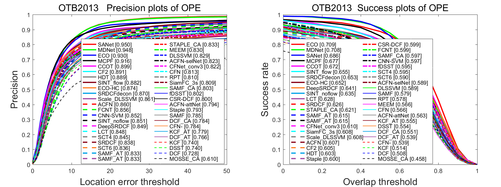
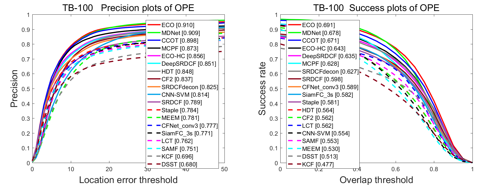
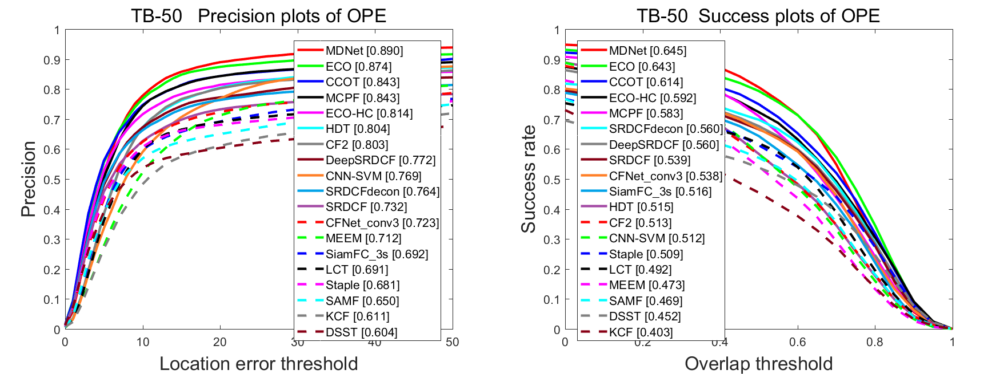

# OTB Results

**Share results for `more recent` trackers.**

:high_brightness: **All results in [[Baidu Yun](https://pan.baidu.com/s/1c27e9Ew)]** :high_brightness:

## Benchmark Results

**The trackers are ordered by the average overlap scores.**

- `AUC` and `Precision` are the standard metrics.

|  Tracker   | AUC-CVPR2013 | Precision-CVPR2013 | AUC-OTB100 | Precision-OTB100 | AUC-OTB50 | Precision-OTB50 | Deep Learning
|:---------: | :----------: | :----------------: | :--------: | :--------------: | :-------: | :-------------: | :-----------:
|    ECO     |      -       |         -          |   0.694    |        -         |     -     |        -        |       Y
|   SANet    |      -       |         -          |   0.692    |      0.928       |     -     |        -        |       Y
|   MDNet    |    0.708     |       0.948        |   0.678    |      0.909       |   0.645   |      0.890      |       Y
|   TCNN     |    0.682     |       0.937        |   0.654    |      0.884       |     -     |        -        |       Y
|   C-COT    |    0.673     |       0.899        |   0.671    |      0.898       |   0.614   |      0.843      |       N
|    CRT     |      -       |         -          |   0.644    |      0.875       |   0.594   |      0.835      |       N
|    DNT     |    0.664     |       0.907        |   0.627    |      0.851       |     -     |        -        |       Y
|   SINT+    |    0.655     |       0.882        |     -      |        -         |     -     |        -        |       Y
|    DRT     |    0.655     |       0.892        |     -      |        -         |     -     |        -        |       Y
|    RDT     |    0.654     |         -          |   0.603    |        -         |     -     |        -        |       Y
|SRDCFdecon  |    0.653     |       0.870        |   0.627    |      0.825       |   0.560   |      0.764      |       N
|  DeepLMCF  |    0.643     |       0.892        |     -      |        -         |     -     |        -        |       Y
|  MUSTer    |    0.641     |       0.865        |   0.575    |      0.774       |     -     |        -        |       N
| DeepSRDCF  |    0.641     |       0.849        |   0.635    |      0.851       |   0.560   |      0.772      |       Y
|   SINT     |    0.635     |       0.851        |     -      |        -         |     -     |        -        |       Y
|    LCT     |    0.628     |       0.848        |   0.562    |      0.762       |   0.492   |      0.691      |       N
|   SRDCF    |    0.626     |       0.838        |   0.598    |      0.789       |   0.539   |      0.732      |       N
|   LMCF     |    0.624     |       0.839        |     -      |        -         |     -     |        -        |       N
|    SCF     |    0.623     |       0.874        |     -      |        -         |     -     |        -        |       N
|  SiamFC    |    0.612     |       0.815        |     -      |        -         |     -     |        -        |       Y
|SiamFC_{3s} |    0.608     |       0.809        |   0.582    |      0.773       |     -     |        -        |       Y
|    CF2     |    0.605     |       0.891        |   0.562    |      0.837       |   0.513   |      0.803      |       Y
|    HDT     |    0.603     |       0.889        |   0.654    |      0.848       |   0.515   |      0.804      |       Y
|  Staple    |    0.600     |       0.793        |   0.578    |      0.784       |     -     |        -        |       N
|   FCNT     |    0.599     |       0.856        |     -      |        -         |     -     |        -        |       Y
|  CNN-SVM   |    0.597     |       0.852        |   0.554    |      0.814       |   0.512   |      0.769      |       Y
|    SCT     |    0.595     |       0.845        |     -      |        -         |     -     |        -        |       Y
|  SO-DLT    |    0.595     |       0.810        |     -      |        -         |     -     |        -        |       Y
|    BIT     |    0.593     |       0.817        |     -      |        -         |     -     |        -        |       N
|  DLSSVM    |    0.589     |       0.829        |   0.541    |      0.767       |     -     |        -        |       Y
|   SAMF     |    0.579     |       0.785        |   0.535    |      0.743       |     -     |        -        |       N
|    RPT     |    0.577     |       0.805        |     -      |        -         |     -     |        -        |       N
|   MEEM     |    0.566     |       0.830        |   0.530    |      0.781       |   0.473   |      0.712      |       N
|   DSST     |    0.554     |       0.737        |   0.520    |      0.693       |   0.463   |      0.625      |       N
|    CNT     |    0.545     |       0.723        |     -      |        -         |     -     |        -        |       Y
|   TGPR     |    0.529     |       0.766        |   0.458    |      0.643       |     -     |        -        |       N
|    KCF     |    0.514     |       0.740        |   0.477    |      0.693       |   0.403   |      0.611      |       N
|   GOTURN   |    0.444     |       0.620        |   0.427    |      0.572       |     -     |        -        |       Y

## Visual Trackers

### ICCV2017

* **CREST:** Yibing Song, Chao Ma, Lijun Gong, Jiawei Zhang, Rynson Lau, Ming-Hsuan Yang. 
  "CREST: Convolutional Residual Learning for Visual Tracking." ICCV (2017 **Spotlight**). 
  [[paper](https://arxiv.org/pdf/1708.00225.pdf)]
  [[project](http://www.cs.cityu.edu.hk/~yibisong/iccv17/index.html)]
  [[github](https://github.com/ybsong00/CREST-Release)]

* **EAST:** Chen Huang, Simon Lucey, Deva Ramanan.. 
  "Learning Policies for Adaptive Tracking with Deep Feature Cascades." ICCV (2017 **Spotlight**). 
  [[paper](https://arxiv.org/pdf/1708.02973v1.pdf)]

* **PTAV:** Heng Fan and Haibin Ling. 
  "Parallel Tracking and Verifying: A Framework for Real-Time and High Accuracy Visual Tracking." ICCV (2017). 
  [[paper](http://www.dabi.temple.edu/~hbling/code/PTAV/PTAV_ICCV17.pdf)]
  [[project](http://www.dabi.temple.edu/~hbling/code/PTAV/ptav.htm)]
  [[code](http://www.dabi.temple.edu/~hbling/code/PTAV/serial_ptav_v1.zip)]

* **BACF:** Hamed Kiani Galoogahi, Ashton Fagg, Simon Lucey. 
  "Learning Background-Aware Correlation Filters for Visual Tracking." ICCV (2017). 
  [[paper](https://arxiv.org/pdf/1703.04590.pdf)]
  [[supp](http://www.hamedkiani.com/uploads/5/1/8/8/51882963/436_sup.pdf)]

* **TSNT:** Zhu Teng, Junliang Xing, Qiang Wang, Congyan Lang, Songhe Feng and Yi Jin.
  "Robust Object Tracking based on Temporal and Spatial Deep Networks." ICCV (2017).

* **RFL:** Tianyu Yang, Antoni B. Chan. 
  "Recurrent Filter Learning for Visual Tracking." ICCV workshop(2017). 
  [[paper](https://arxiv.org/pdf/1708.03874.pdf)]

### CVPR2017

* **ECO:** Martin Danelljan, Goutam Bhat, Fahad Shahbaz Khan, Michael Felsberg. 
  "ECO: Efficient Convolution Operators for Tracking." CVPR (2017). 
  [[paper](http://openaccess.thecvf.com/content_cvpr_2017/papers/Danelljan_ECO_Efficient_Convolution_CVPR_2017_paper.pdf)]
  [[supp](http://openaccess.thecvf.com/content_cvpr_2017/supplemental/Danelljan_ECO_Efficient_Convolution_2017_CVPR_supplemental.pdf)]
  [[project](http://www.cvl.isy.liu.se/research/objrec/visualtracking/ecotrack/index.html)]
  [[github](https://github.com/martin-danelljan/ECO)]

* **CFNet:** Jack Valmadre, Luca Bertinetto, João F. Henriques, Andrea Vedaldi, Philip H. S. Torr.
  "End-to-end representation learning for Correlation Filter based tracking." CVPR (2017). 
  [[paper](http://openaccess.thecvf.com/content_cvpr_2017/papers/Valmadre_End-To-End_Representation_Learning_CVPR_2017_paper.pdf)]
  [[supp](http://openaccess.thecvf.com/content_cvpr_2017/supplemental/Valmadre_End-To-End_Representation_Learning_2017_CVPR_supplemental.pdf)]
  [[project](http://www.robots.ox.ac.uk/~luca/cfnet.html)]
  [[github](https://github.com/bertinetto/cfnet)]

* **CACF:** Matthias Mueller, Neil Smith, Bernard Ghanem. 
  "Context-Aware Correlation Filter Tracking." CVPR (2017 **oral**). 
  [[paper](http://openaccess.thecvf.com/content_cvpr_2017/papers/Mueller_Context-Aware_Correlation_Filter_CVPR_2017_paper.pdf)]
  [[supp](http://openaccess.thecvf.com/content_cvpr_2017/supplemental/Mueller_Context-Aware_Correlation_Filter_2017_CVPR_supplemental.zip)]
  [[project](https://ivul.kaust.edu.sa/Pages/pub-ca-cf-tracking.aspx)]
  [[code](https://github.com/thias15/Context-Aware-CF-Tracking)]

* **RaF:** Le Zhang, Jagannadan Varadarajan, Ponnuthurai Nagaratnam Suganthan, Narendra Ahuja and Pierre Moulin
  "Robust Visual Tracking Using Oblique Random Forests." CVPR (2017). 
  [[paper](http://openaccess.thecvf.com/content_cvpr_2017/papers/Zhang_Robust_Visual_Tracking_CVPR_2017_paper.pdf)]
  [[supp](http://openaccess.thecvf.com/content_cvpr_2017/supplemental/Zhang_Robust_Visual_Tracking_2017_CVPR_supplemental.pdf)]
  [[project](https://sites.google.com/site/zhangleuestc/incremental-oblique-random-forest)]
  [[code](https://github.com/ZhangLeUestc/Incremental-Oblique-Random-Forest)]

* **MCPF:** Tianzhu Zhang, Changsheng Xu, Ming-Hsuan Yang. 
  "Multi-Task Correlation Particle Filter for Robust Object Tracking." CVPR (2017). 
  [[paper](http://openaccess.thecvf.com/content_cvpr_2017/papers/Zhang_Multi-Task_Correlation_Particle_CVPR_2017_paper.pdf)]
  [[project](http://nlpr-web.ia.ac.cn/mmc/homepage/tzzhang/mcpf.html)]
  [[code](http://nlpr-web.ia.ac.cn/mmc/homepage/tzzhang/mcpf.html)]

* **ACFN:** Jongwon Choi, Hyung Jin Chang, Sangdoo Yun, Tobias Fischer, Yiannis Demiris, and Jin Young Choi.
  "Attentional Correlation Filter Network for Adaptive Visual Tracking." CVPR (2017).
  [[paper](http://openaccess.thecvf.com/content_cvpr_2017/papers/Choi_Attentional_Correlation_Filter_CVPR_2017_paper.pdf)]
  [[supp](http://openaccess.thecvf.com/content_cvpr_2017/supplemental/Choi_Attentional_Correlation_Filter_2017_CVPR_supplemental.pdf)]
  [[project](https://sites.google.com/site/jwchoivision/home/acfn-1)]
  [[test code](https://drive.google.com/file/d/0B0ZkG8zaRQoLQUswbW9qSWFaU0U/view?usp=drive_web)]
  [[training code](https://drive.google.com/file/d/0B0ZkG8zaRQoLZVVranBnbHlydnM/view?usp=drive_web)]

* **LMCF:** Mengmeng Wang, Yong Liu, Zeyi Huang. 
  "Large Margin Object Tracking with Circulant Feature Maps." CVPR (2017). 
  [[paper](http://openaccess.thecvf.com/content_cvpr_2017/papers/Wang_Large_Margin_Object_CVPR_2017_paper.pdf)]
  [[zhihu](https://zhuanlan.zhihu.com/p/25761718)]

* **ADNet:** Sangdoo Yun, Jongwon Choi, Youngjoon Yoo, Kimin Yun, Jin Young Choi.
  "Action-Decision Networks for Visual Tracking with Deep Reinforcement Learning." CVPR (2017 **Spotlight**). 
  [[paper](http://openaccess.thecvf.com/content_cvpr_2017/papers/Yun_Action-Decision_Networks_for_CVPR_2017_paper.pdf)]
  [[supp](http://openaccess.thecvf.com/content_cvpr_2017/supplemental/Yun_Action-Decision_Networks_for_2017_CVPR_supplemental.pdf)]
  [[project](https://sites.google.com/view/cvpr2017-adnet)]

* **CSR-DCF:** Alan Lukežič, Tomáš Vojíř, Luka Čehovin, Jiří Matas, Matej Kristan. 
  "Discriminative Correlation Filter with Channel and Spatial Reliability." CVPR (2017). 
  [[paper](http://openaccess.thecvf.com/content_cvpr_2017/papers/Lukezic_Discriminative_Correlation_Filter_CVPR_2017_paper.pdf)]
  [[supp](http://openaccess.thecvf.com/content_cvpr_2017/supplemental/Lukezic_Discriminative_Correlation_Filter_2017_CVPR_supplemental.pdf)]
  [[code](https://github.com/alanlukezic/csr-dcf)]

* **BranchOut:** Bohyung Han, Jack Sim, Hartwig Adam.
  "BranchOut: Regularization for Online Ensemble Tracking with Convolutional Neural Networks." CVPR (2017). 
  [[paper](http://openaccess.thecvf.com/content_cvpr_2017/papers/Han_BranchOut_Regularization_for_CVPR_2017_paper.pdf)]

* **AMCT:** Donghun Yeo, Jeany Son, Bohyung Han, Joonhee Han.
  "Superpixel-based Tracking-by-Segmentation using Markov Chains." CVPR (2017).
  [[paper](http://openaccess.thecvf.com/content_cvpr_2017/papers/Yeo_Superpixel-Based_Tracking-By-Segmentation_Using_CVPR_2017_paper.pdf)]

* **SANet:** Heng Fan, Haibin Ling. 
  "SANet: Structure-Aware Network for Visual Tracking." CVPRW (2017). 
  [[paper](https://arxiv.org/pdf/1611.06878.pdf)]
  [[project](http://www.dabi.temple.edu/~hbling/code/SANet/SANet.html)]
  [[code](http://www.dabi.temple.edu/~hbling/code/SANet/sanet_code.zip)]

### ECCV2016

* **SiameseFC:** Luca Bertinetto, Jack Valmadre, João F. Henriques, Andrea Vedaldi, Philip H.S. Torr. 
  "Fully-Convolutional Siamese Networks for Object Tracking." ECCV workshop (2016). 
  [[paper](http://120.52.73.78/arxiv.org/pdf/1606.09549v2.pdf)]
  [[project](http://www.robots.ox.ac.uk/~luca/siamese-fc.html)]
  [[github](https://github.com/bertinetto/siamese-fc)]

* **GOTURN:** David Held, Sebastian Thrun, Silvio Savarese. 
  "Learning to Track at 100 FPS with Deep Regression Networks." ECCV (2016). 
  [[paper](http://davheld.github.io/GOTURN/GOTURN.pdf)]
  [[project](http://davheld.github.io/GOTURN/GOTURN.html)]
  [[github](https://github.com/davheld/GOTURN)]

* **C-COT:** Martin Danelljan, Andreas Robinson, Fahad Khan, Michael Felsberg. 
  "Beyond Correlation Filters: Learning Continuous Convolution Operators for Visual Tracking." ECCV (2016). 
  [[paper](http://www.cvl.isy.liu.se/research/objrec/visualtracking/conttrack/C-COT_ECCV16.pdf)]
  [[project](http://www.cvl.isy.liu.se/research/objrec/visualtracking/conttrack/index.html)]
  [[github](https://github.com/martin-danelljan/Continuous-ConvOp)]

* **CF+AT:** Adel Bibi, Matthias Mueller, and Bernard Ghanem. 
  "Target Response Adaptation for Correlation Filter Tracking." ECCV (2016). 
  [[paper](http://www.adelbibi.com/papers/ECCV2016/Target_Adap.pdf)]
  [project]

* Yao Sui, Ziming Zhang,  Guanghui Wang, Yafei Tang, Li Zhang. 
  "Real-Time Visual Tracking: Promoting the Robustness of Correlation Filter Learning." ECCV (2016). 
  [[paper](http://120.52.73.78/arxiv.org/pdf/1608.08173.pdf)]

* Yao Sui, Guanghui Wang, Yafei Tang, Li Zhang. 
  "Tracking Completion." ECCV (2016). 
  [[paper](http://120.52.73.78/arxiv.org/pdf/1608.08171v1.pdf)]

### CVPR2016

* **MDNet:** Nam, Hyeonseob, and Bohyung Han. 
  "Learning Multi-Domain Convolutional Neural Networks for Visual Tracking." CVPR (2016).
  [[paper](http://arxiv.org/pdf/1510.07945v2.pdf)]
  [[VOT_presentation](http://votchallenge.net/vot2015/download/presentation_Hyeonseob.pdf)]
  [[project](http://cvlab.postech.ac.kr/research/mdnet/)]
  [[github](https://github.com/HyeonseobNam/MDNet)]

* **SINT:** Ran Tao, Efstratios Gavves, Arnold W.M. Smeulders. 
  "Siamese Instance Search for Tracking." CVPR (2016).
  [[paper](https://staff.science.uva.nl/r.tao/pub/TaoCVPR2016.pdf)]
  [[project](https://staff.fnwi.uva.nl/r.tao/projects/SINT/SINT_proj.html)]

* **SCT:** Jongwon Choi, Hyung Jin Chang, Jiyeoup Jeong, Yiannis Demiris, and Jin Young Choi.
  "Visual Tracking Using Attention-Modulated Disintegration and Integration." CVPR (2016).
  [[paper](http://www.cv-foundation.org/openaccess/content_cvpr_2016/papers/Choi_Visual_Tracking_Using_CVPR_2016_paper.pdf)]
  [[project](https://sites.google.com/site/jwchoivision/home/sct)]

* **STCT:** Lijun Wang, Wanli Ouyang, Xiaogang Wang, and Huchuan Lu.
  "STCT: Sequentially Training Convolutional Networks for Visual Tracking." CVPR (2016).
  [[paper](http://www.ee.cuhk.edu.hk/~wlouyang/Papers/WangLJ_CVPR16.pdf)]
  [[github](https://github.com/scott89/STCT)]

* **SRDCFdecon:** Martin Danelljan, Gustav Häger, Fahad Khan, Michael Felsberg. 
  "Adaptive Decontamination of the Training Set: A Unified Formulation for Discriminative Visual Tracking." CVPR (2016).
  [[paper](https://www.cvl.isy.liu.se/research/objrec/visualtracking/decontrack/AdaptiveDecon_CVPR16.pdf)]
  [[project](https://www.cvl.isy.liu.se/research/objrec/visualtracking/decontrack/index.html)]

* **HDT:** Yuankai Qi, Shengping Zhang, Lei Qin, Hongxun Yao, Qingming Huang, Jongwoo Lim, Ming-Hsuan Yang. 
  "Hedged Deep Tracking." CVPR (2016). 
  [[paper](http://faculty.ucmerced.edu/mhyang/papers/cvpr16_hedge_tracking.pdf)]
  [[project](https://sites.google.com/site/yuankiqi/hdt/)]

* **Staple:** Luca Bertinetto, Jack Valmadre, Stuart Golodetz, Ondrej Miksik, Philip H.S. Torr. 
  "Staple: Complementary Learners for Real-Time Tracking." CVPR (2016). 
  [[paper](http://120.52.73.75/arxiv.org/pdf/1512.01355v2.pdf)]
  [[project](http://www.robots.ox.ac.uk/~luca/staple.html)]
  [[github](https://github.com/bertinetto/staple)]

* **EBT:** Gao Zhu, Fatih Porikli, and Hongdong Li.
  "Beyond Local Search: Tracking Objects Everywhere with Instance-Specific Proposals." CVPR (2016). 
  [[paper](http://www.cv-foundation.org/openaccess/content_cvpr_2016/papers/Zhu_Beyond_Local_Search_CVPR_2016_paper.pdf)]
  [[exe](http://www.votchallenge.net/vot2016/download/02_EBT.zip)]

* **DLSSVM:** Jifeng Ning, Jimei Yang, Shaojie Jiang, Lei Zhang and Ming-Hsuan Yang. 
  "Object Tracking via Dual Linear Structured SVM and Explicit Feature Map." CVPR (2016). 
  [[paper](http://www4.comp.polyu.edu.hk/~cslzhang/paper/cvpr16/DLSSVM.pdf)]
  [[code](http://www4.comp.polyu.edu.hk/~cslzhang/code/DLSSVM_CVPR.zip)]
  [[project](http://www4.comp.polyu.edu.hk/~cslzhang/DLSSVM/DLSSVM.htm)]

### NIPS2016
* **Learnet:** Luca Bertinetto, João F. Henriques, Jack Valmadre, Philip H. S. Torr, Andrea Vedaldi. 
  "Learning feed-forward one-shot learners." NIPS (2016). 
  [[paper](https://arxiv.org/pdf/1606.05233v1.pdf)]

### ICCV2015

* **FCNT:** Lijun Wang, Wanli Ouyang, Xiaogang Wang, and Huchuan Lu. 
  "Visual Tracking with Fully Convolutional Networks." ICCV (2015). 
  [[paper](http://202.118.75.4/lu/Paper/ICCV2015/iccv15_lijun.pdf)]
  [[project](http://scott89.github.io/FCNT/)]
  [[github](https://github.com/scott89/FCNT)]

* **SRDCF:** Martin Danelljan, Gustav Häger, Fahad Khan, Michael Felsberg. 
  "Learning Spatially Regularized Correlation Filters for Visual Tracking." ICCV (2015). 
  [[paper](https://www.cvl.isy.liu.se/research/objrec/visualtracking/regvistrack/SRDCF_ICCV15.pdf)]
  [[project](https://www.cvl.isy.liu.se/research/objrec/visualtracking/regvistrack/)]

* **CF2:** Chao Ma, Jia-Bin Huang, Xiaokang Yang and Ming-Hsuan Yang.
  "Hierarchical Convolutional Features for Visual Tracking." ICCV (2015)
  [[paper](http://faculty.ucmerced.edu/mhyang/papers/iccv15_tracking.pdf)]
  [[project](https://sites.google.com/site/jbhuang0604/publications/cf2)]
  [[github](https://github.com/jbhuang0604/CF2)]

* **LCT:** Chao Ma, Xiaokang Yang, Chongyang Zhang, Ming-Hsuan Yang.
  "Long-term Correlation Tracking." CVPR (2015).
  [[paper](https://drive.google.com/file/d/0B8-i_hZvGyZNMzc5QWtINjhIMU0/view)]
  [[project](https://sites.google.com/site/chaoma99/cvpr15_tracking)]
  [[github](https://github.com/chaoma99/lct-tracker)]

* Naiyan Wang, Jianping Shi, Dit-Yan Yeung and Jiaya Jia.
  "Understanding and Diagnosing Visual Tracking Systems." ICCV (2015). 
  [[paper](http://winsty.net/papers/diagnose.pdf)]
  [[project](http://winsty.net/tracker_diagnose.html)]
  [[code](http://winsty.net/diagnose/diagnose_code.zip)]\

* **DeepSRDCF:** Martin Danelljan, Gustav Häger, Fahad Khan, Michael Felsberg. 
  "Convolutional Features for Correlation Filter Based Visual Tracking." ICCV workshop (2015). 
  [[paper](https://www.cvl.isy.liu.se/research/objrec/visualtracking/regvistrack/ConvDCF_ICCV15_VOTworkshop.pdf)]
  [[project](https://www.cvl.isy.liu.se/research/objrec/visualtracking/regvistrack/)]

* **RAJSSC:** Mengdan Zhang, Junliang Xing, Jin Gao, Xinchu Shi, Qiang Wang, Weiming Hu. 
  "Joint Scale-Spatial Correlation Tracking with Adaptive Rotation Estimation." ICCV workshop (2015). 
  [[paper](http://www.cv-foundation.org//openaccess/content_iccv_2015_workshops/w14/papers/Zhang_Joint_Scale-Spatial_Correlation_ICCV_2015_paper.pdf)]
  [[poster](http://www.votchallenge.net/vot2015/download/poster_Mengdan_Zhang.pdf)]

### CVPR2015

* **DAT:** Horst Possegger, Thomas Mauthner, and Horst Bischof. 
  "In Defense of Color-based Model-free Tracking." CVPR (2015). 
  [[paper](https://lrs.icg.tugraz.at/pubs/possegger_cvpr15.pdf)]
  [[project](https://www.tugraz.at/institute/icg/research/team-bischof/lrs/downloads/dat)]
  [[code](https://lrs.icg.tugraz.at/downloads/dat-v1.0.zip)]

* **RPT:** Yang Li, Jianke Zhu and Steven C.H. Hoi. 
  "Reliable Patch Trackers: Robust Visual Tracking by Exploiting Reliable Patches." CVPR (2015). 
  [[paper](https://github.com/ihpdep/ihpdep.github.io/raw/master/papers/cvpr15_rpt.pdf)]
  [[github](https://github.com/ihpdep/rpt)]

### ICML2015

* **CNN-SVM:** Seunghoon Hong, Tackgeun You, Suha Kwak and Bohyung Han.
  "Online Tracking by Learning Discriminative Saliency Map with Convolutional Neural Network ." ICML (2015)
  [[paper](http://120.52.73.80/arxiv.org/pdf/1502.06796.pdf)]
  [[project](http://cvlab.postech.ac.kr/research/CNN_SVM/)]

### BMVC2014

* **DSST:** Martin Danelljan, Gustav Häger, Fahad Shahbaz Khan and Michael Felsberg. 
  "Accurate Scale Estimation for Robust Visual Tracking." BMVC (2014).
  [[paper](http://www.cvl.isy.liu.se/research/objrec/visualtracking/scalvistrack/ScaleTracking_BMVC14.pdf)]
  [[PAMI](http://www.cvl.isy.liu.se/en/research/objrec/visualtracking/scalvistrack/DSST_TPAMI.pdf)]
  [[project](http://www.cvl.isy.liu.se/en/research/objrec/visualtracking/scalvistrack/index.html)]

### ECCV2014

* **MEEM:** Jianming Zhang, Shugao Ma, and Stan Sclaroff.
  "MEEM: Robust Tracking via Multiple Experts using Entropy Minimization." ECCV (2014).
  [[paper](http://cs-people.bu.edu/jmzhang/MEEM/MEEM-eccv-preprint.pdf)]
  [[project](http://cs-people.bu.edu/jmzhang/MEEM/MEEM.html)]

* **TGPR:** Jin Gao, Haibin Ling, Weiming Hu, Junliang Xing.
  "Transfer Learning Based Visual Tracking with Gaussian Process Regression." ECCV (2014).
  [[paper](http://www.dabi.temple.edu/~hbling/publication/tgpr-eccv14.pdf)]
  [[project](http://www.dabi.temple.edu/~hbling/code/TGPR.htm)]

* **STC:** Kaihua Zhang, Lei Zhang, Ming-Hsuan Yang, David Zhang.
  "Fast Tracking via Spatio-Temporal Context Learning." ECCV (2014).
  [[paper](http://arxiv.org/pdf/1311.1939v1.pdf)]
  [[project](http://www4.comp.polyu.edu.hk/~cslzhang/STC/STC.htm)]

* **SAMF:** Yang Li, Jianke Zhu.
  "A Scale Adaptive Kernel Correlation Filter Tracker with Feature Integration." ECCV workshop (2014).
  [[paper](http://link.springer.com/content/pdf/10.1007%2F978-3-319-16181-5_18.pdf)]
  [[github](https://github.com/ihpdep/samf)]

### NIPS2013

* **DLT:** Naiyan Wang and Dit-Yan Yeung. 
  "Learning A Deep Compact Image Representation for Visual Tracking." NIPS (2013). 
  [[paper](http://winsty.net/papers/dlt.pdf)]
  [[project](http://winsty.net/dlt.html)]
  [[code](http://winsty.net/dlt/DLTcode.zip)]

### PAMI & IJCV & TIP

* **KCF:** João F. Henriques, Rui Caseiro, Pedro Martins, Jorge Batista. 
  "High-Speed Tracking with Kernelized Correlation Filters." TPAMI (2015).
  [[paper](http://www.robots.ox.ac.uk/~joao/publications/henriques_tpami2015.pdf)]
  [[project](http://www.robots.ox.ac.uk/~joao/circulant/)]

* **CLRST:** Tianzhu Zhang, Si Liu, Narendra Ahuja, Ming-Hsuan Yang, Bernard Ghanem.  
  "Robust Visual Tracking Via Consistent Low-Rank Sparse Learning." IJCV (2015). 
  [[paper](http://nlpr-web.ia.ac.cn/mmc/homepage/tzzhang/tianzhu%20zhang_files/Journal%20Articles/IJCV15_zhang_Low-Rank%20Sparse%20Learning.pdf)]
  [[project](http://nlpr-web.ia.ac.cn/mmc/homepage/tzzhang/Project_Tianzhu/zhang_IJCV14/Robust%20Visual%20Tracking%20Via%20Consistent%20Low-Rank%20Sparse.html)]
  [[code](http://nlpr-web.ia.ac.cn/mmc/homepage/tzzhang/Project_Tianzhu/zhang_IJCV14/material/LRT_Code.zip)]

* **DNT:** Zhizhen Chi, Hongyang Li, Huchuan Lu, Ming-Hsuan Yang. 
  "Dual Deep Network for Visual Tracking." TIP (2017). 
  [[paper](https://arxiv.org/pdf/1612.06053v1.pdf)]

* **DRT:** Junyu Gao, Tianzhu Zhang, Xiaoshan Yang, Changsheng Xu. 
  "Deep Relative Tracking." TIP (2017). 
  [[paper](http://ieeexplore.ieee.org/abstract/document/7828108/)]

* **BIT:** Bolun Cai, Xiangmin Xu, Xiaofen Xing, Kui Jia, Jie Miao, Dacheng Tao.
  "BIT: Biologically Inspired Tracker." TIP (2016). 
  [[paper](http://caibolun.github.io/papers/BIT_TIP.pdf)]
  [[project](http://caibolun.github.io/BIT/index.html)]
  [[github](https://github.com/caibolun/BIT)]

* **CNT:** Kaihua Zhang, Qingshan Liu, Yi Wu, Minghsuan Yang. 
  "Robust Visual Tracking via Convolutional Networks Without Training." TIP (2016). 
  [[paper](http://kaihuazhang.net/CNT.pdf)]
  [[code](http://kaihuazhang.net/CNT_matlab.rar)]

## ArXiv

* **PAWSS:** Xiaofei Du, Alessio Dore, Danail Stoyanov. 
  "Patch-based adaptive weighting with segmentation and scale (PAWSS) for visual tracking." arXiv (2017). 
  [[paper](https://arxiv.org/pdf/1708.01179v1.pdf)]

* **SFT:** Zhen Cui, You yi Cai, Wen ming Zheng, Jian Yang. 
  "Spectral Filter Tracking." arXiv (2017). 
  [[paper](https://arxiv.org/pdf/1707.05553v1.pdf)]

* **HART:** Adam R. Kosiorek, Alex Bewley, Ingmar Posner. 
  "Hierarchical Attentive Recurrent Tracking." arXiv (2017). 
  [[paper](https://arxiv.org/pdf/1706.09262.pdf)]
  [[github](https://github.com/akosiorek/hart)]

* **Re3:** Daniel Gordon, Ali Farhadi, Dieter Fox. 
  "Re3 : Real-Time Recurrent Regression Networks for Object Tracking." arXiv (2017). 
  [[paper](https://arxiv.org/pdf/1705.06368.pdf)]

* **DCFNet:** Qiang Wang, Jin Gao, Junliang Xing, Mengdan Zhang, Weiming Hu. 
  "DCFNet: Discriminant Correlation Filters Network for Visual Tracking." arXiv (2017). 
  [[paper](https://arxiv.org/pdf/1704.04057.pdf)]
  [[code](https://github.com/foolwood/DCFNet#dcfnet-discriminant-correlation-filters-network-for-visual-tracking)]

* **TCNN:** Hyeonseob Nam, Mooyeol Baek, Bohyung Han. 
  "Modeling and Propagating CNNs in a Tree Structure for Visual Tracking." arXiv (2016). 
  [[paper](http://arxiv.org/pdf/1608.07242v1.pdf)]
  [[code](http://www.votchallenge.net/vot2016/download/44_TCNN.zip)]

* **RDT:** Janghoon Choi, Junseok Kwon, Kyoung Mu Lee. 
  "Visual Tracking by Reinforced Decision Making." arXiv (2017). 
  [[paper](https://arxiv.org/pdf/1702.06291.pdf)]

* **MSDAT:** Xinyu Wang, Hanxi Li, Yi Li, Fumin Shen, Fatih Porikli .
  "Robust and Real-time Deep Tracking Via Multi-Scale Domain Adaptation." arXiv (2017). 
  [[paper](https://arxiv.org/pdf/1701.00561.pdf)]

* **RLT:** Da Zhang, Hamid Maei, Xin Wang, Yuan-Fang Wang.
  "Deep Reinforcement Learning for Visual Object Tracking in Videos." arXiv (2017). 
  [[paper](https://arxiv.org/pdf/1701.08936v1.pdf)]

* **SCF:** Wangmeng Zuo, Xiaohe Wu, Liang Lin, Lei Zhang, Ming-Hsuan Yang. 
  "Learning Support Correlation Filters for Visual Tracking." arXiv (2016).
  [[paper](https://arxiv.org/pdf/1601.06032.pdf)]
  [[project](http://faculty.ucmerced.edu/mhyang/project/scf/)]

* **CRT:** Kai Chen, Wenbing Tao. 
  "Convolutional Regression for Visual Tracking." arXiv (2016). 
  [[paper](https://arxiv.org/pdf/1611.04215.pdf)]

* **BMR:** Kaihua Zhang, Qingshan Liu, and Ming-Hsuan Yang. 
  "Visual Tracking via Boolean Map Representations." arXiv (2016). 
  [[paper](https://arxiv.org/pdf/1610.09652v1.pdf)]

* **YCNN:** Kai Chen, Wenbing Tao. 
  "Once for All: a Two-flow Convolutional Neural Network for Visual Tracking." arXiv (2016). 
  [[paper](https://arxiv.org/pdf/1604.07507v1.pdf)]

* **ROLO:** Guanghan Ning, Zhi Zhang, Chen Huang, Zhihai He, Xiaobo Ren, Haohong Wang. 
  "Spatially Supervised Recurrent Convolutional Neural Networks for Visual Object Tracking." arXiv (2016). 
  [[paper](http://arxiv.org/pdf/1607.05781v1.pdf)]
  [[project](http://guanghan.info/projects/ROLO/)]
  [[github](https://github.com/Guanghan/ROLO/)]

* **RATM:** Samira Ebrahimi Kahou, Vincent Michalski, Roland Memisevic. 
  "RATM: Recurrent Attentive Tracking Model." arXiv (2015). 
  [[paper](https://arxiv.org/pdf/1510.08660v4.pdf)]
  [[github](https://github.com/saebrahimi/RATM)]

* **SO-DLT:** Naiyan Wang, Siyi Li, Abhinav Gupta, Dit-Yan Yeung. 
  "Transferring Rich Feature Hierarchies for Robust Visual Tracking." arXiv (2015). 
  [[paper](https://arxiv.org/pdf/1501.04587v2.pdf)]
  [[code](http://www.votchallenge.net/vot2016/download/08_SO-DLT.zip)]

* **DMSRDCF:** Susanna Gladh, Martin Danelljan, Fahad Shahbaz Khan, Michael Felsberg. 
  "Deep Motion Features for Visual Tracking." ICPR **Best Paper** (2016). 
  [[paper](https://arxiv.org/pdf/1612.06615v1.pdf)]

## Benchmark

* **Dataset-Nfs:** Hamed Kiani Galoogahi, Ashton Fagg, Chen Huang, Deva Ramanan and Simon Lucey.
  "Need for Speed: A Benchmark for Higher Frame Rate Object Tracking." ICCV (2017)
  [[paper](https://arxiv.org/pdf/1703.05884.pdf)]
  [[project](http://ci2cv.net/nfs/index.html)]

* **Dataset-DTB70:** Siyi Li, Dit-Yan Yeung.
  "Visual Object Tracking for Unmanned Aerial Vehicles: A Benchmark and New Motion Models." AAAI (2017)
  [[paper](http://aaai.org/ocs/index.php/AAAI/AAAI17/paper/view/14338/14292)]
  [[project](https://github.com/flyers/drone-tracking)]
  [[dataset](https://www.dropbox.com/s/s1fj99s2six4lrs/DTB70.tar.gz?dl=0)]

* **Dataset-MoBe2016:** Luka Čehovin, Alan Lukežič, Aleš Leonardis, Matej Kristan.
  "Beyond standard benchmarks: Parameterizing performance evaluation in visual object tracking." arXiv (2016). 
  [[paper](https://arxiv.org/pdf/1612.00089v1.pdf)]

* **Dataset-UAV123:** Matthias Mueller, Neil Smith and Bernard Ghanem.
  "A Benchmark and Simulator for UAV Tracking." ECCV (2016)
  [[paper](https://ivul.kaust.edu.sa/Documents/Publications/2016/A%20Benchmark%20and%20Simulator%20for%20UAV%20Tracking.pdf)]
  [[project](https://ivul.kaust.edu.sa/Pages/pub-benchmark-simulator-uav.aspx)]
  [[dataset](https://ivul.kaust.edu.sa/Pages/Dataset-UAV123.aspx)]

* **Dataset-TColor-128:** Pengpeng Liang, Erik Blasch, Haibin Ling.
  "Encoding color information for visual tracking: Algorithms and benchmark." TIP (2015)
  [[paper](http://www.dabi.temple.edu/~hbling/publication/TColor-128.pdf)]
  [[project](http://www.dabi.temple.edu/~hbling/data/TColor-128/TColor-128.html)]
  [[dataset](http://www.dabi.temple.edu/~hbling/data/TColor-128/Temple-color-128.zip)]

* **Dataset-NUS-PRO:** Annan Li, Min Lin, Yi Wu, Ming-Hsuan Yang, and Shuicheng Yan.
  "NUS-PRO: A New Visual Tracking Challenge." PAMI (2015)
  [[paper](http://faculty.ucmerced.edu/mhyang/papers/pami15_nus_pro.pdf)]
  [[project](https://sites.google.com/site/li00annan/nus-pro)]
  [[Data_360](https://d9fca6.lc.yunpan.cn/lk/cqKIc6DU3t2eJ)(code:bf28)]
  [[Data_baidu]](https://pan.baidu.com/s/1pJHvbSn#list/path=%2F)]
  [[View_360](https://6aa275.lc.yunpan.cn/lk/cqK479PfzDrPX)(code:515a)]
  [[View_baidu]](https://pan.baidu.com/s/1hqKXcuK)]

* **Dataset-PTB:** Shuran Song and Jianxiong Xiao.
  "Tracking Revisited using RGBD Camera: Unified Benchmark and Baselines." ICCV (2013)
  [[paper](http://vision.princeton.edu/projects/2013/tracking/paper.pdf)]
  [[project](http://tracking.cs.princeton.edu/)]
  [[5 validation](http://tracking.cs.princeton.edu/ValidationSet.zip)]
  [[95 evaluation](http://tracking.cs.princeton.edu/EvaluationSet.tgz)]

* **Dataset-ALOV300+:** Arnold W. M. Smeulders, Dung M. Chu, Rita Cucchiara, Simone Calderara, Afshin Dehghan, Mubarak Shah.
  "Visual Tracking: An Experimental Survey." PAMI (2014)
  [[paper](http://crcv.ucf.edu/papers/Tracking_Survey.pdf)]
  [[project](http://imagelab.ing.unimore.it/dsm/)]
  [Mirror Link:ALOV300++ Dataset](http://crcv.ucf.edu/people/phd_students/afshin/ALOV300/Frames.zip)
  [Mirror Link:ALOV300++ Groundtruth](http://crcv.ucf.edu/people/phd_students/afshin/ALOV300/GT.zip)

* **OTB2013:** Wu, Yi, Jongwoo Lim, and Minghsuan Yang. 
  "Online Object Tracking: A Benchmark." CVPR (2013).
  [[paper](http://faculty.ucmerced.edu/mhyang/papers/cvpr13_benchmark.pdf)]

* **OTB2015:** Wu, Yi, Jongwoo Lim, and Minghsuan Yang. 
  "Object Tracking Benchmark." TPAMI (2015).
  [[paper](http://ieeexplore.ieee.org/stamp/stamp.jsp?tp=&arnumber=7001050&tag=1)]
  [[project](http://cvlab.hanyang.ac.kr/tracker_benchmark/index.html)]

* **Dataset-VOT:**
  **[[project](http://www.votchallenge.net/)]**

**[[VOT13_paper_ICCV](http://www.votchallenge.net/vot2013/Download/vot_2013_paper.pdf)]The Visual Object Tracking VOT2013 challenge results**

**[[VOT14_paper_ECCV](http://www.votchallenge.net/vot2014/download/vot_2014_paper.pdf)]The Visual Object Tracking VOT2014 challenge results**

**[[VOT15_paper_ICCV](http://www.votchallenge.net/vot2015/download/vot_2015_paper.pdf)]The Visual Object Tracking VOT2015 challenge results**

**[[VOT16_paper_ECCV](http://www.votchallenge.net/vot2016/download/vot_2016_paper.pdf)]The Visual Object Tracking VOT2016 challenge results**

## Distinguished Researchers & Teams
Distinguished visual tracking researchers who have published +3 papers which have a major impact on the field of visual tracking and are still active in the field of visual tracking.(Names listed in no particular order, I will continue to supplement this part.)

* [Ming-Hsuan Yang](http://faculty.ucmerced.edu/mhyang/)
* [Haibin Ling](http://www.dabi.temple.edu/~hbling/)
* [Huchuan Lu](http://ice.dlut.edu.cn/lu/)
* [Hongdong Li](http://users.cecs.anu.edu.au/~hongdong/)
* [Lei Zhang](http://www4.comp.polyu.edu.hk/~cslzhang/)
* [Xiaogang Wang](http://www.ee.cuhk.edu.hk/~xgwang/)
* [Matej Kristan](http://www.vicos.si/People/Matejk)
* [João F. Henriques](http://www.robots.ox.ac.uk/~joao/)
* [Martin Danelljan](http://users.isy.liu.se/cvl/marda26/)
* [Kaihua Zhang](http://kaihuazhang.net/)
* [Hamed Kiani](http://www.hamedkiani.com/)
* [Luca Bertinetto](http://www.robots.ox.ac.uk/~luca/index.html)
* [Tianzhu Zhang](http://nlpr-web.ia.ac.cn/mmc/homepage/tzzhang/index.html)
* [**Torr Vision Group**](http://www.robots.ox.ac.uk/~tvg/people.php)
* [**Computer Vision Laboratory, POSTECH**](http://cvlab.postech.ac.kr/lab/index.php)
