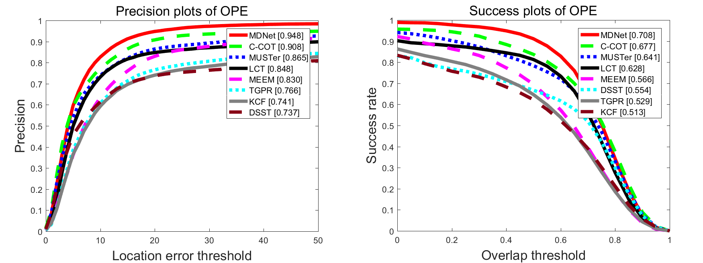

# OTB Results

**Share results for `more recent` trackers.**

:high_brightness: **All results in [[Baidu Yun](https://pan.baidu.com/s/1c27e9Ew)]** :high_brightness:

#OTB50



##Visual Trackers

* **SiameseFC:** Luca Bertinetto, Jack Valmadre, João F. Henriques, Andrea Vedaldi, Philip H.S. Torr. 
"Fully-Convolutional Siamese Networks for Object Tracking." arXiv (2016). 
[[paper](http://120.52.73.78/arxiv.org/pdf/1606.09549v1.pdf)]
[[project](http://www.robots.ox.ac.uk/~luca/siamese-fc.html)]
[[github](https://github.com/bertinetto/siamese-fc)]

* **TCNN:** Hyeonseob Nam, Mooyeol Baek, Bohyung Han. 
"Modeling and Propagating CNNs in a Tree Structure for Visual Tracking." arXiv (2016). 
[[paper](http://120.52.73.76/arxiv.org/pdf/1608.07242v1.pdf)]
[project]

* **GOTURN:** David Held, Sebastian Thrun, Silvio Savarese. 
"Learning to Track at 100 FPS with Deep Regression Networks." ECCV (2016). 
[[paper](http://davheld.github.io/GOTURN/GOTURN.pdf)]
[[project](http://davheld.github.io/GOTURN/GOTURN.html)]
[[github](https://github.com/davheld/GOTURN)]

* **C-COT:** Martin Danelljan, Andreas Robinson, Fahad Khan, Michael Felsberg. 
"Beyond Correlation Filters: Learning Continuous Convolution Operators for Visual Tracking." ECCV (2016). 
[[paper](http://www.cvl.isy.liu.se/research/objrec/visualtracking/conttrack/C-COT_ECCV16.pdf)]
[[project](http://www.cvl.isy.liu.se/research/objrec/visualtracking/conttrack/index.html)]
[[github](https://github.com/martin-danelljan/Continuous-ConvOp)]

* **CF+AT:** Adel Bibi, Matthias Mueller, and Bernard Ghanem. 
"Target Response Adaptation for Correlation Filter Tracking." ECCV (2016). 
[[paper](http://www.adelbibi.com/papers/ECCV2016/Target_Adap.pdf)]
[project]

* **MDNet:** Nam, Hyeonseob, and Bohyung Han. 
"Learning Multi-Domain Convolutional Neural Networks for Visual Tracking." CVPR (2016).
[[paper](http://arxiv.org/pdf/1510.07945v2.pdf)]
[[VOT_presentation](http://votchallenge.net/vot2015/download/presentation_Hyeonseob.pdf)]
[[project](http://cvlab.postech.ac.kr/research/mdnet/)]
[[github](https://github.com/HyeonseobNam/MDNet)]

* **SINT:** Ran Tao, Efstratios Gavves, Arnold W.M. Smeulders. 
"Siamese Instance Search for Tracking." CVPR (2016).
[[paper](https://staff.science.uva.nl/r.tao/pub/TaoCVPR2016.pdf)]
[[project](https://staff.fnwi.uva.nl/r.tao/projects/SINT/SINT_proj.html)]

* **SCT:** Jongwon Choi, Hyung Jin Chang, Jiyeoup Jeong, Yiannis Demiris, and Jin Young Choi.
"Visual Tracking Using Attention-Modulated Disintegration and Integration." CVPR (2016).
[[paper](http://www.cv-foundation.org/openaccess/content_cvpr_2016/papers/Choi_Visual_Tracking_Using_CVPR_2016_paper.pdf)]
[[project](https://sites.google.com/site/jwchoivision/home/sct)]

* **SRDCFdecon:** Martin Danelljan, Gustav Häger, Fahad Khan, Michael Felsberg. 
"Adaptive Decontamination of the Training Set: A Unified Formulation for Discriminative Visual Tracking." CVPR (2016).
[[paper](https://www.cvl.isy.liu.se/research/objrec/visualtracking/decontrack/AdaptiveDecon_CVPR16.pdf)]
[[project](https://www.cvl.isy.liu.se/research/objrec/visualtracking/decontrack/index.html)]

* **HDT:** Yuankai Qi, Shengping Zhang, Lei Qin, Hongxun Yao, Qingming Huang, Jongwoo Lim, Ming-Hsuan Yang. 
"Hedged Deep Tracking." CVPR (2016). 
[[paper](http://faculty.ucmerced.edu/mhyang/papers/cvpr16_hedge_tracking.pdf)]
[[project](https://sites.google.com/site/yuankiqi/hdt/)]

* **Staple:** Luca Bertinetto, Jack Valmadre, Stuart Golodetz, Ondrej Miksik, Philip H.S. Torr. 
"Staple: Complementary Learners for Real-Time Tracking." CVPR (2016). 
[[paper](http://120.52.73.75/arxiv.org/pdf/1512.01355v2.pdf)]
[[project](http://www.robots.ox.ac.uk/~luca/staple.html)]
[[github](https://github.com/bertinetto/staple)]

* **DLSSVM:** Jifeng Ning, Jimei Yang, Shaojie Jiang, Lei Zhang and Ming-Hsuan Yang. 
"Object Tracking via Dual Linear Structured SVM and Explicit Feature Map." CVPR (2016). 
[[paper](http://www4.comp.polyu.edu.hk/~cslzhang/paper/cvpr16/DLSSVM.pdf)]
[[code](http://www4.comp.polyu.edu.hk/~cslzhang/code/DLSSVM_CVPR.zip)]

* **CNT:** Kaihua Zhang, Qingshan Liu, Yi Wu, Minghsuan Yang. 
"Robust Visual Tracking via Convolutional Networks Without Training." TIP (2016). 
[[paper](http://kaihuazhang.net/CNT.pdf)]
[[code](http://kaihuazhang.net/CNT_matlab.rar)]

* **DeepSRDCF:** Martin Danelljan, Gustav Häger, Fahad Khan, Michael Felsberg. 
"Convolutional Features for Correlation Filter Based Visual Tracking." ICCV workshop (2015). 
[[paper](https://www.cvl.isy.liu.se/research/objrec/visualtracking/regvistrack/ConvDCF_ICCV15_VOTworkshop.pdf)]
[[project](https://www.cvl.isy.liu.se/research/objrec/visualtracking/regvistrack/)]

* **SRDCF:** Martin Danelljan, Gustav Häger, Fahad Khan, Michael Felsberg. 
"Learning Spatially Regularized Correlation Filters for Visual Tracking." ICCV (2015). 
[[paper](https://www.cvl.isy.liu.se/research/objrec/visualtracking/regvistrack/SRDCF_ICCV15.pdf)]
[[project](https://www.cvl.isy.liu.se/research/objrec/visualtracking/regvistrack/)]

* **CNN-SVM:** Seunghoon Hong, Tackgeun You, Suha Kwak and Bohyung Han.
"Online Tracking by Learning Discriminative Saliency Map with Convolutional Neural Network ." ICML (2015)
[[paper](http://120.52.73.80/arxiv.org/pdf/1502.06796.pdf)]
[[project](http://cvlab.postech.ac.kr/research/CNN_SVM/)]

* **CF2:** Chao Ma, Jia-Bin Huang, Xiaokang Yang and Ming-Hsuan Yang.
"Hierarchical Convolutional Features for Visual Tracking." ICCV (2015)
[[paper](http://faculty.ucmerced.edu/mhyang/papers/iccv15_tracking.pdf)]
[[project](https://sites.google.com/site/jbhuang0604/publications/cf2)]
[[github](https://github.com/jbhuang0604/CF2)]

* **FCNT:** Lijun Wang, Wanli Ouyang, Xiaogang Wang, and Huchuan Lu. 
"Visual Tracking with Fully Convolutional Networks." ICCV (2015). 
[[paper](http://202.118.75.4/lu/Paper/ICCV2015/iccv15_lijun.pdf)]
[[project](http://scott89.github.io/FCNT/)]
[[github](https://github.com/scott89/FCNT)]

* **LCT:** Chao Ma, Xiaokang Yang, Chongyang Zhang, Ming-Hsuan Yang.
"Long-term Correlation Tracking." CVPR (2015).
[[paper](https://drive.google.com/file/d/0B8-i_hZvGyZNMzc5QWtINjhIMU0/view)]
[[project](https://sites.google.com/site/chaoma99/cvpr15_tracking)]
[[github](https://github.com/chaoma99/lct-tracker)]

* **RPT:** Yang Li, Jianke Zhu and Steven C.H. Hoi. 
"Reliable Patch Trackers: Robust Visual Tracking by Exploiting Reliable Patches." CVPR (2015). 
[[paper](https://github.com/ihpdep/ihpdep.github.io/raw/master/papers/cvpr15_rpt.pdf)]
[[github](https://github.com/ihpdep/rpt)]

* **DSST:** Martin Danelljan, Gustav Häger, Fahad Shahbaz Khan and Michael Felsberg. 
"Accurate Scale Estimation for Robust Visual Tracking." BMVC (2014).
[[paper](http://www.cvl.isy.liu.se/research/objrec/visualtracking/scalvistrack/ScaleTracking_BMVC14.pdf)]
[[project](http://www.cvl.isy.liu.se/en/research/objrec/visualtracking/scalvistrack/index.html)]

* **MEEM:** Jianming Zhang, Shugao Ma, and Stan Sclaroff.
"MEEM: Robust Tracking via Multiple Experts using Entropy Minimization." ECCV (2014).
[[paper](http://cs-people.bu.edu/jmzhang/MEEM/MEEM-eccv-preprint.pdf)]
[[project](http://cs-people.bu.edu/jmzhang/MEEM/MEEM.html)]

* **TGPR:** Jin Gao, Haibin Ling, Weiming Hu, Junliang Xing.
"Transfer Learning Based Visual Tracking with Gaussian Process Regression." ECCV (2014).
[[paper](http://www.dabi.temple.edu/~hbling/publication/tgpr-eccv14.pdf)]
[[project](http://www.dabi.temple.edu/~hbling/code/TGPR.htm)]

* **STC:** Kaihua Zhang, Lei Zhang, Ming-Hsuan Yang, David Zhang.
"Fast Tracking via Spatio-Temporal Context Learning." ECCV (2014).
[[paper](http://arxiv.org/pdf/1311.1939v1.pdf)]
[[project](http://www4.comp.polyu.edu.hk/~cslzhang/STC/STC.htm)]

* **SAMF:** Yang Li, Jianke Zhu.
"A Scale Adaptive Kernel Correlation Filter Tracker with Feature Integration." ECCV workshop (2014).
[[paper](http://link.springer.com/content/pdf/10.1007%2F978-3-319-16181-5_18.pdf)]
[[github](https://github.com/ihpdep/samf)]

* **KCF:** João F. Henriques, Rui Caseiro, Pedro Martins, Jorge Batista. 
"High-Speed Tracking with Kernelized Correlation Filters." TPAMI (2015).
[[paper](http://www.robots.ox.ac.uk/~joao/publications/henriques_tpami2015.pdf)]
[[project](http://www.robots.ox.ac.uk/~joao/circulant/)]

##Others

* **ROLO:** Guanghan Ning, Zhi Zhang, Chen Huang, Zhihai He, Xiaobo Ren, Haohong Wang. 
"Spatially Supervised Recurrent Convolutional Neural Networks for Visual Object Tracking." arXiv (2016). 
[[paper](http://arxiv.org/pdf/1607.05781v1.pdf)]
[[project](http://guanghan.info/projects/ROLO/)]
[[github](https://github.com/Guanghan/ROLO/)]

* Yao Sui, Ziming Zhang,  Guanghui Wang, Yafei Tang, Li Zhang. 
"Real-Time Visual Tracking: Promoting the Robustness of Correlation Filter Learning." ECCV (2016). 
[[paper](http://120.52.73.78/arxiv.org/pdf/1608.08173.pdf)]
[project]

* Yao Sui, Guanghui Wang, Yafei Tang, Li Zhang. 
"Tracking Completion." ECCV (2016). 
[[paper](http://120.52.73.78/arxiv.org/pdf/1608.08171v1.pdf)]
[project]

* **EBT:**Gao Zhu, Fatih Porikli, and Hongdong Li.
"Beyond Local Search: Tracking Objects Everywhere with Instance-Specific Proposals." CVPR (2016). 
[[paper](http://www.cv-foundation.org/openaccess/content_cvpr_2016/papers/Zhu_Beyond_Local_Search_CVPR_2016_paper.pdf)]

* **DAT:**Horst Possegger, Thomas Mauthner, and Horst Bischof. 
"In Defense of Color-based Model-free Tracking." CVPR (2015). 
[[paper](https://lrs.icg.tugraz.at/pubs/possegger_cvpr15.pdf)]
[[project](https://lrs.icg.tugraz.at/members/possegger)]
[[code](https://lrs.icg.tugraz.at/downloads/dat-v1.0.zip)]

* **RAJSSC:**Mengdan Zhang, Junliang Xing, Jin Gao, Xinchu Shi, Qiang Wang, Weiming Hu. 
"Joint Scale-Spatial Correlation Tracking with Adaptive Rotation Estimation." ICCV workshop (2015). 
[[paper](http://www.cv-foundation.org//openaccess/content_iccv_2015_workshops/w14/papers/Zhang_Joint_Scale-Spatial_Correlation_ICCV_2015_paper.pdf)]
[[poster](http://www.votchallenge.net/vot2015/download/poster_Mengdan_Zhang.pdf)]

* **SO-DLT:**Naiyan Wang, Siyi Li, Abhinav Gupta, Dit-Yan Yeung. 
"Transferring Rich Feature Hierarchies for Robust Visual Tracking." arXiv (2015). 
[[paper](https://arxiv.org/pdf/1501.04587v2.pdf)]

* **DLT:**Naiyan Wang and Dit-Yan Yeung. 
"Learning A Deep Compact Image Representation for Visual Tracking." NIPS (2013). 
[[paper](http://winsty.net/papers/dlt.pdf)]
[[project](http://winsty.net/dlt.html)]
[[code](http://winsty.net/dlt/DLTcode.zip)]

* Naiyan Wang, Jianping Shi, Dit-Yan Yeung and Jiaya Jia.
"Understanding and Diagnosing Visual Tracking Systems." ICCV (2015). 
[[paper](http://winsty.net/papers/diagnose.pdf)]
[[project](http://winsty.net/tracker_diagnose.html)]
[[code](http://winsty.net/diagnose/diagnose_code.zip)]

* **Dataset-UAV123:**Matthias Mueller, Neil Smith and Bernard Ghanem.
"A Benchmark and Simulator for UAV Tracking." ECCV (2016)
[[paper](https://ivul.kaust.edu.sa/Documents/Publications/2016/A%20Benchmark%20and%20Simulator%20for%20UAV%20Tracking.pdf)]
[[project](https://ivul.kaust.edu.sa/Pages/pub-benchmark-simulator-uav.aspx)]
[[dataset](https://ivul.kaust.edu.sa/Pages/Dataset-UAV123.aspx)]

* **Dataset-TColor-128:**Pengpeng Liang, Erik Blasch, Haibin Ling.
"Encoding color information for visual tracking: Algorithms and benchmark." TIP (2015)
[[paper](http://www.dabi.temple.edu/~hbling/publication/TColor-128.pdf)]
[[project](http://www.dabi.temple.edu/~hbling/data/TColor-128/TColor-128.html)]
[[dataset](http://www.dabi.temple.edu/~hbling/data/TColor-128/Temple-color-128.zip)]

* **Dataset-PTB:**Shuran Song and Jianxiong Xiao.
"Tracking Revisited using RGBD Camera: Unified Benchmark and Baselines." ICCV (2013)
[[paper](Tracking Revisited using RGBD Camera: Unified Benchmark and Baselines )]
[[project](http://tracking.cs.princeton.edu/)]
[[5 validation](http://tracking.cs.princeton.edu/ValidationSet.zip)]
[[95 evaluation](http://tracking.cs.princeton.edu/EvaluationSet.tgz)]

* **Dataset-VOT:**
**[[project](http://www.votchallenge.net/)]**

**[[VOT13_paper_ICCV](http://www.votchallenge.net/vot2013/Download/vot_2013_paper.pdf)]The Visual Object Tracking VOT2013 challenge results**

**[[VOT14_paper_ECCV](http://www.votchallenge.net/vot2014/download/vot_2014_paper.pdf)]The Visual Object Tracking VOT2014 challenge results**

**[[VOT15_paper_ICCV](http://www.votchallenge.net/vot2015/download/vot_2015_paper.pdf)]The Visual Object Tracking VOT2015 challenge results**

**[[VOT16_paper_ECCV]()]The Visual Object Tracking VOT2016 challenge results**

##Benchmark Results
**The trackers are ordered by the average overlap scores.**

* ``AUC`` and ``Precision`` are the standard metrics.
* ``OS``(overlap success rate at the overlap threshold of 0.5)

```
sum(overlap_per_image>0.5,2)/29486;
```

* ``DP``(distance precision at the threshold of 20 pixels)

```
DP = sum(CLE_per_image<=20,2)/29486;
```

* ``CLE``(center location error)	

```
CLE = sum(CLE_per_image,2)/29486
```

|   Tracker   |   AUC   |   Precision   |   OS (%)   |   DP(%)   |   CLE (pixel)   |   FPS   |   Deep Learning   |
|:-----------:|:---------:| ----------:| ---------------:| -------:| -------------:|--------:|------------------:|
|  MDNet  |0.70767|0.94803|0.95106|0.95472|6.315|--|Y|
|  C-COT  |0.6725|0.89912|0.91315|0.92993|10.5263|0.22798|N|
|  SINT+  |0.65517|0.88157|0.86801|0.90626|9.7901|--|Y|
|  SRDCFdecon  |0.65257|0.86967|0.89531|0.92291|14.8125|2.5178|N|
|  MUSTer  |0.64107|0.86458|0.87184|0.92407|9.3628|269.45|N|
|  DeepSRDCF  |0.64073|0.84881|0.86292|0.90233|13.0293|0.22315|Y|
|  SINT  |0.63495|0.85064|0.84939|0.88279|13.3137|--|Y|
|  LCT  |0.62786|0.84802|0.8795|0.90514|13.993|21.6258|N|
|  SRDCF  |0.6262|0.83795|0.8523|0.88489|21.9456|4.4961|N|
|  SiamFC  |0.61217|0.81532|0.8386|0.85285|23.8246|--|Y|
|  SiamFC_{3s}  |0.60829|0.80922|0.83379|0.85013|20.904|--|Y|
|  CF2  |0.60466|0.8907|0.75473|0.88289|17.9674|11.0193|Y|
|  HDT  |0.60279|0.88853|0.75609|0.88327|17.9539|6.2642|Y|
|  Staple  |0.59952|0.79256|0.82192|0.86061|21.6479|46.9301|N|
|  FCNT  |0.59902|0.85587|0.8425|0.89775|11.8177|--|Y|
|  CNN-SVM  |0.5971|0.85159|0.77589|0.87238|14.1727|--|Y|
|  SCT  |0.59526|0.84546|0.77257|0.87177|13.8994|10|Y|
|  DLSSVM  |0.58915|0.82884|0.76067|0.85441|21.7044|10.0478|Y|
|  SAMF  |0.57935|0.78495|0.7974|0.84718|21.6129|25.9113|N|
|  RPT  |0.57694|0.8045|0.79638|0.8636|21.4296|6.2387|N|
|  MEEM  |0.56596|0.83004|0.7569|0.86855|15.4204|20.8363|N|
|  DSST  |0.55386|0.73705|0.77349|0.81713|26.5619|60.5094|N|
|  CNT  |0.54475|0.72309|0.7411|0.77454|35.663|--|Y|
|  TGPR  |0.5294|0.76612|0.6773|0.78329|29.9533|1.5218|N|
|  KCF  |0.5138|0.73999|0.69599|0.83202|21.0937|230.0655|N|


Benchmark
----------
* Wu, Yi, Jongwoo Lim, and Minghsuan Yang. 
"Online Object Tracking: A Benchmark." CVPR (2013).
[[paper](http://faculty.ucmerced.edu/mhyang/papers/cvpr13_benchmark.pdf)]
* Wu, Yi, Jongwoo Lim, and Minghsuan Yang. 
"Object Tracking Benchmark." TPAMI (2015).
[[paper](http://ieeexplore.ieee.org/stamp/stamp.jsp?tp=&arnumber=7001050&tag=1)]
[[project](http://cvlab.hanyang.ac.kr/tracker_benchmark/index.html)]
